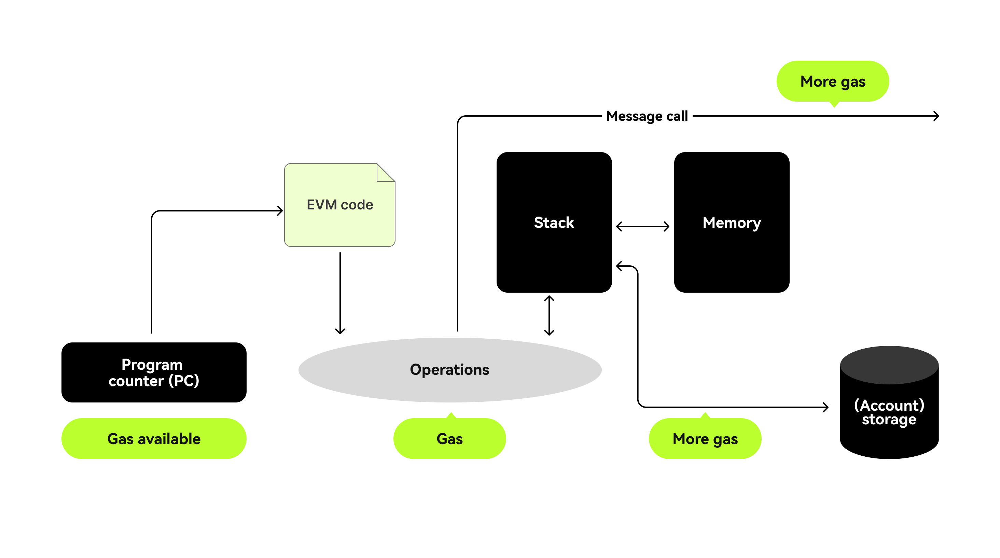

# Gas Fees

Gas refers to the unit that measures the amount of computational effort required to execute specific operations on the Ethereum network.

Since each Ethereum transaction requires computational resources to execute, those resources have to be paid for to ensure Ethereum is not vulnerable to spam and cannot get stuck in infinite computational loops. Payment for computation is made in the form of a gas fee.

The gas fee is **the amount of gas used to do some operation, multiplied by the cost per unit gas**. The fee is paid regardless of whether a transaction succeeds or fails.

The EVM operates on a unique cost model where initializing a variable requires a minimum of 20,000 gas, changing it costs a minimum of 5,000 gas, and basic arithmetic operations, such as adding two numbers, only cost 3 gas. This means that storage operations are significantly more expensive than computation in terms of gas expenditure.

Furthermore, the concept of space complexity takes on a critical role. While in traditional programming, storage is relatively inexpensive, in Solidity, storing and manipulating data in storage incurs substantial gas costs. For instance, it is often more economical to repeatedly calculate a value derived from other data than to calculate it once and save it due to the high gas costs associated with storage operations.

Predictable execution paths are crucial, as each transaction comes with a predetermined gas limit. Failure to accurately estimate and manage gas consumption may result in transaction failures, but users will still be charged for the gas used up until the point of failure. This highlights the importance of careful coding practices to optimize gas efficiency and ensure a cost-effective and reliable user experience in decentralized applications.

