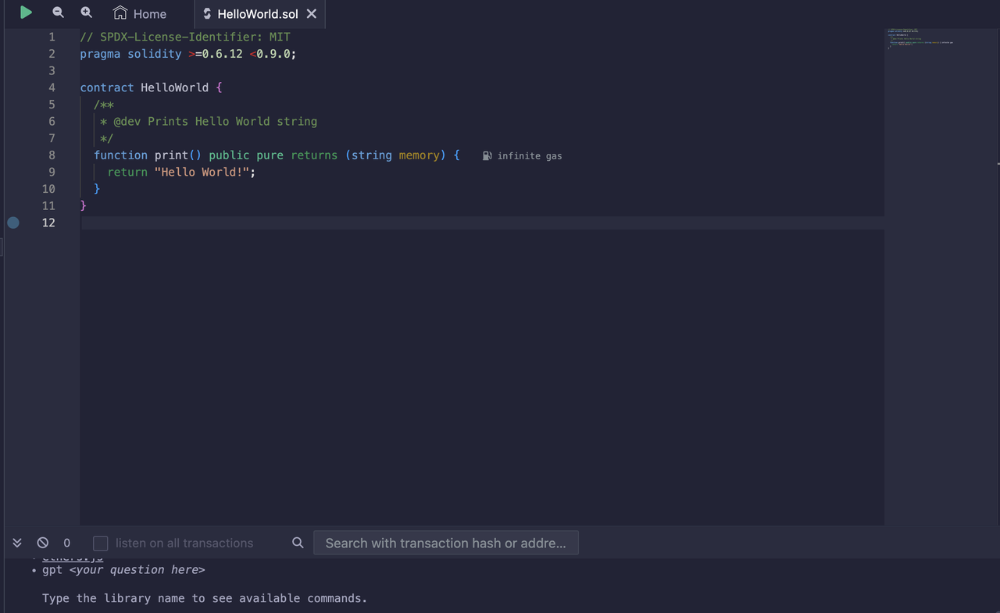
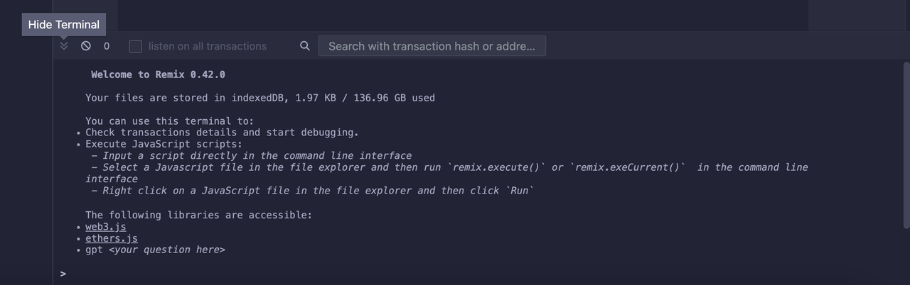

# Features

## Editor Pane

The editor pane loads with the Remix home screen, which contains useful guides and warnings about common scams. Double-click on `HelloWorld.sol` to open it in the editor. You also have the option of closing the home tab if you want to.

You can edit your code under the editor pane, which will consist of features such as syntax and error highlighting. Do note that errors are highlighted with exclaimation marks next to the line number where the error is occurring.

##  Terminal Output

The terminal is directly below the editor pane. You can use this terminal panel to observe transaction logs from your smart contract and access the debugging tools in Remix. You also have the option to hide the terminal.

## Left Panel

The left panel in Remix has multiple vertical tabs. It allows you to switch between tools and functions. You can also create and switch between your workspaces, search your code and access a number of plugins.

## Plugins

Remix primarily relies on plugins, with the most commonly used ones being active from the start. To access and control plugins, simply click the plug button located in the lower-left corner, just above the settings gear. Activation or deactivation of plugins can be easily done by clicking the activate/deactivate option. Certain plugins, like the Debug plugin, are automatically triggered through various sections of the editor.

## Compiler

The initial default plugin, following the search function, is the Solidity Compiler. Make sure to enable the Auto compile option. Since smart contracts are typically small files, enabling this option should not pose any performance issues during code editing.

The functionality of the Compile and Run script button in this plugin may be a bit misleading. It is not the usual method for testing your contract. For more information on this feature, click the 'I' button.

In case there are errors in your contracts, the complete text for each error will be displayed at the bottom of the pane. Experiment with this feature by introducing some typos into the HelloWorld.sol file.