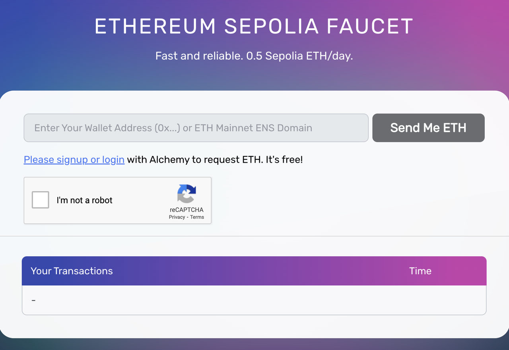
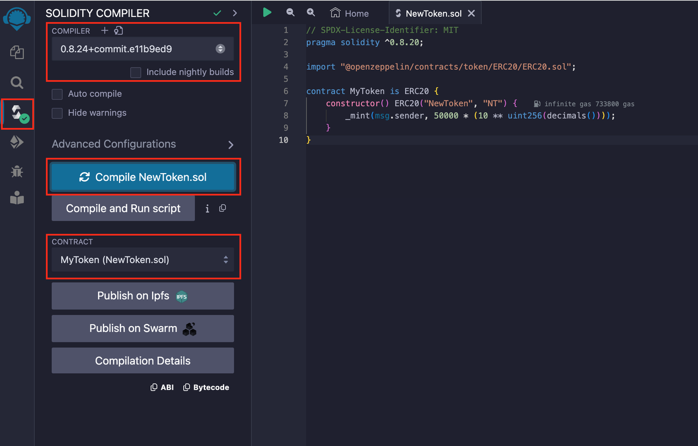
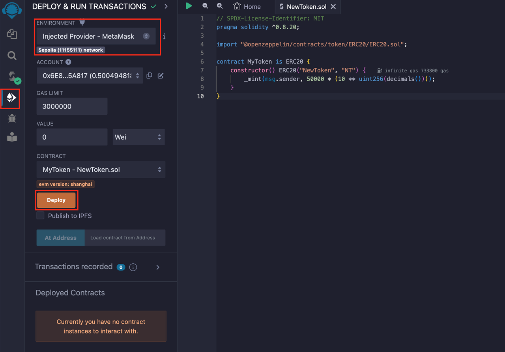
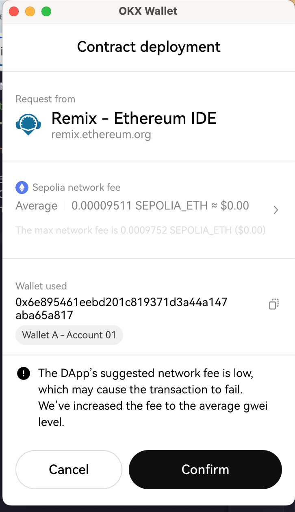
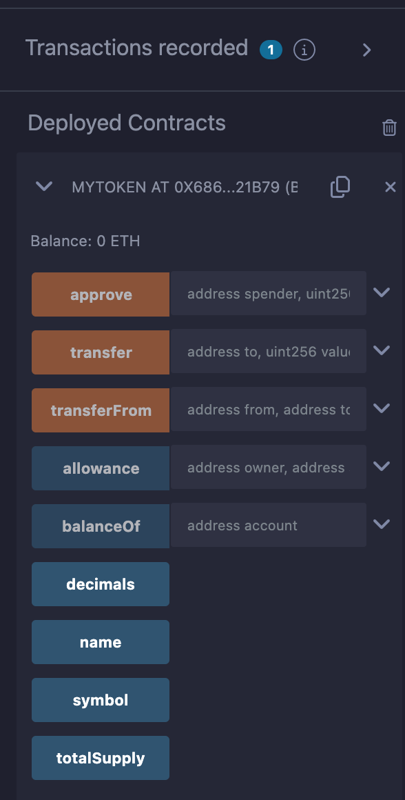
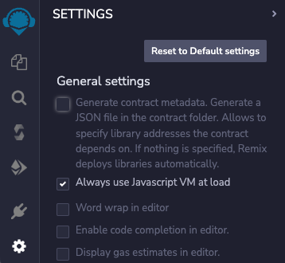

# How to create and deploy an ERC-20 token

Now that you understand more about what ERC-20 tokens are, and how Remix is structured, it is time to create and deploy your own ERC-20 token! In this section, you will learn how to create and deploy an ERC-20 token using Remix.IDE!

## What you need

-   A Web3 Wallet (e.g OKX wallet or a WalletConnect-compatible wallet)
    
-   Testnet Ethereum ( You can request some at the [Ethereum Sepolia Facuet](https://www.alchemy.com/faucets/ethereum-sepolia))
    
-   A Web Browser (e.g., Google Chrome)
    

  

## Step 1

Download a Web3 wallet. You can download OKX’s wallet from [here](https://chromewebstore.google.com/detail/okx-wallet/mcohilncbfahbmgdjkbpemcciiolgcge) or read more about installing a Web3 compatible wallet on [our website](https://www.okx.com/oktc/docs/dev/quick-start/wallet/metamask/quick-start#install-a-web3-compatible-wallet).

##  Step 2

Once your wallet is set up, you will have to acquire some test ETH from the Ethereum Sepolia Facuet. Simply enter your wallet address and login to Alchemy to a small amount of test ETH.



##  Step 3

Open [Remix](https://remix.ethereum.org/) and make a new Solidity file, for instance NewToken.sol.

``` sol
// SPDX-License-Identifier: MIT

pragma solidity ^0.8.20;

import "@openzeppelin/contracts/token/ERC20/ERC20.sol";

contract MyToken is ERC20 {

constructor() ERC20("MyToken", "MT") {

_mint(msg.sender, 1000000 * (10 ** uint256(decimals())));

}

}
```


Click on the **Compile** button. Do verify that the compiler’s version is at least **0.8.20** because of the line `pragma solidity ^0.8.20;` in the editor pane. You should see a green tick mark on the **Compile** button! Well done!

##  Step 3 Code breakdown

To help you understand the code better, here is a breakdown of the code we have written in **Step 3**!


1.  **SPDX-License-Identifier Comment**:
    
    1.  This comment specifies the license under which the smart contract is released. It helps in identifying the open-source license associated with the code.
        
2.  **Pragma Directive**:
    
    1.  The pragma directive specifies the compiler version to use. It ensures that the code is compiled with a specific version of the compiler to avoid compatibility issues.
        
3.  **Importing ERC-20 from OpenZeppelin**:
    
    1.  The ERC-20 contract from OpenZeppelin is a well-established and widely used implementation of the ERC-20 standard, providing a foundation for creating tokens.
        
4.  **Creating MyToken Contract**:
    
    1.  The `MyToken` contract is being defined and it extends the functionality of the ERC-20 contract. This means it inherits all the functions and features from the ERC-20 contract.
        
5.  **Constructor Function**:
    
    1.  The constructor function is a special function that is executed only once when the contract is deployed. In this case, it initializes the token with a name ("MyToken") and a symbol ("MTK").
        
6.  **Minting Initial Supply**:
    
    1.  The `_mint` function within the constructor is used to mint an initial supply of tokens. In this example, 1 million tokens are created and assigned to the address that deploys the contract.
        
7.  **Decimals Adjustment**:
    
    1.  The number of tokens minted is adjusted by the `decimals` value. The `decimals` value is a standard in ERC-20 contracts and is often set to 18 by default in OpenZeppelin’s implementation.
        
8.  You can see the full ERC-20 code on the OpenZeppelin website [here](https://github.com/OpenZeppelin/openzeppelin-contracts/blob/master/contracts/token/ERC20/ERC20.sol).
    

## Step 4

Great! Now click on the **Deploy & Run Transaction** button. For deployment, use the **Injected Provider option under Environment.** Connect to your Web3 wallet and select the Sepolia Test network. Then, click deploy.



> If you receive an error message before deployment - “This contract may be abstract”, ensure that the correct contract is selected under the Contract tab.

## Step 5

Confirm the transaction in your Web3 wallet. In this case, we are using the OKX wallet.



Confirm the transaction in your wallet.

Congratulations! Your contract is now deployed on Ethereum’s Sepolia test network! To see the contract that you have deployed, click on "Deployed Contracts" to see the functions of the contract. You should be able to edit the contract name as well.




## Conclusion:

Congratulations! You have created your very own token on the Ethereum Sepolia Test network!

## Storing and Retrieving a Value

Utilizing the input to store and retrieve a value incurs a gas cost, and the nuanced aspect lies in the distinction between storing and retrieving.

Both operations approximately cost 23500 gas. However, there’s an important nuance: the gas cost for the retrieve function is only applicable when it is called by another contract. When called from the web, there is no gas cost because you are merely reading data from the blockchain. In this case, you are not instructing the EVM to perform a computational task, making the retrieval operation free when accessed from the web.

##  Disabling Artifact Generation

  



Navigate back to the File Explorer by clicking the double document icon in the upper left corner. You will now observe a folder named "artifacts" that has been included in your project. This folder houses various build artifacts, including the ABI for your contract, which will prove valuable in the future but may currently contribute to clutter.

To disable this, you can deactivate artifact generation. Click the settings gear in the bottom left corner and then uncheck the first checkbox labeled "Generate contract metadata...".