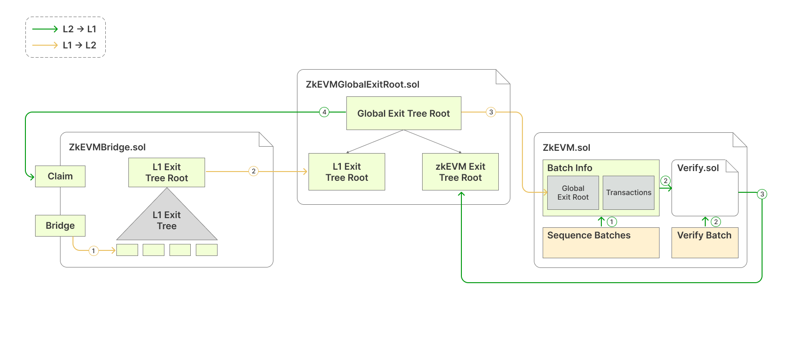
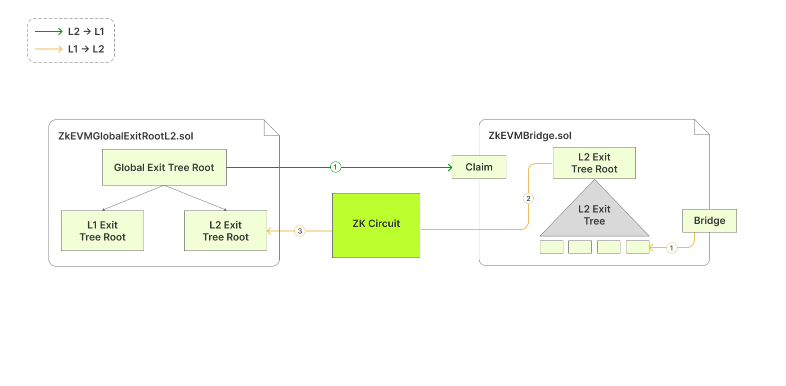

# Asset transfer
This section describes how asset transfers are enabled by three smart contracts.
- Bridge smart contract ([ZkEVMBridge.sol](https://github.com/okx/xlayer-contracts/blob/release/v0.3.0/contracts/v2/PolygonZkEVMBridgeV2.sol "ZkEVMBridge.sol"))
- Global Exit Root Manager ([ZkEVMGlobalExitRoot.sol](https://github.com/okx/xlayer-contracts/blob/release/v0.3.0/contracts/v2/PolygonZkEVMGlobalExitRootV2.sol "ZkEVMGlobalExitRoot.sol"))
- Consensus contract ([ZkEVM.sol](https://github.com/okx/xlayer-contracts/blob/release/v0.3.0/contracts/v2/consensus/validium/PolygonValidiumEtrog.sol "ZkEVM.sol"))

## Bridge smart contract
The ZKEVM bridge smart contract (ZkEVMBridge.sol) has two main functions:
- Bridge (or deposit) function
- Claim (or withdrawal) function

With these functions, we can bridge assets from one network to another, as well as claim assets received in the destination network.
1. User `Deposit` transfers assets layer 2 -> layer 1 or  layer 1 -> layer 2. The bridge smart contract SC adds an exit leaf to the layer 2 exit tree, which holds the relevant transfer data. 
2. Subsequently, the root of the layer 2 exit tree is updated and becomes accessible for the next smart contract in the workflow, known as the Global Exit Root Manager SC.
3. User `Claim` assets on opposite chain bridge SC.

<Tip title="Note">There are two bridge smart contracts: ‌one deployed in layer 1, while the other is deployed in layer 2, both using the same ZKEVMBridge.sol code file, but using different parameters for the interaction.</Tip>

## Global exit root manager contract
The Global Exit Root Manager SC, implemented as `ZkEVMGlobalExitRoot.sol`, serves as the overseer of the Global Exit Tree Root. Its primary responsibilities include updating the Global Exit Tree Root and serving as a storage hub for the historical data of the Global Exit Tree. 

This contract has a main function:
- `updateExitRoot`
This separation of logic between the ZKEVM bridge SC and the Global Exit Root Manager SC has been strategically implemented to enhance interoperability, which uses the function `updateExitRoot`.

This means that the ZKEVM bridge SC, in conjunction with the Global Exit Root Manager SC, can be installed on any network to achieve the same results.

<Tip title="Note">There are two Global Exit Root manager SCs: one deployed in L1, while the other is deployed in layer 2. Their Solidity code files are; ZkEVMGlobalExitRoot.sol, and ZkEVMGlobalExitRootL2.sol, respectively.</Tip>

## Consensus contract
The `ZkEVM.sol` smart contract is the consensus algorithm used in X Layer. It is located in L1 for batch verification purposes.
The consensus smart contract (ZkEVM.sol) has two main functions:
- `sequenceBatchesValidium`
- `verifyBatchesTrustedAggregator`

With these functions, layer 2 tx data can be rolled up and verified. 
1. Transactions are grouped into batches by `sequenceBatchesValidium` function.
2. A request is made to an aggregator to prove the validity of these sequenced batches by `verifyBatchesTrustedAggregator`. This proof is ZK-proof and is verified using the `Verifier.sol` contract.
3. Following the verification of the ZK-proof, the consensus contract sends the ZKEVM Exit Tree Root to the Global Exit Root Manager SC `ZkEVMGlobalExitRoot.sol` to update the Global Exit Root.

## Smart contract interactions
The following diagram illustrates the interactions among the three bridge-related smart contracts when assets are bridged. It describes the overall process of transferring assets from layer 1 to layer 2 and from layer 2 to layer 1 through contracts.

### layer 1 → layer 2 transfer
1. When the user commits to transferring assets, the bridge SC `ZkEVMBridge.sol` uses the Bridge method to append the corresponding exit leaf to the L1 Exit Tree.
2. The updated root of the L1 Exit Tree is sent to the Global Exit Root Manager `ZkEVMGlobalExitRoot.sol` for an update of the Global Exit Root.
3. The consensus contract `ZkEVM.sol` retrieves the updated Global Exit Root from the Global Exit Root Manager, which is used for syncing with the ZKEVM as the destination network for bridged assets.

The transfer from layer 1 to ZKEVM is completed with the `Claim` method of the bridge SC, but this time in the ZKEVM side.

### layer 2 → layer 1 transfer
Now the reverse process, while focusing only at the L1 smart contracts.
1. The consensus contract uses the `sequenceBatchesValidium` function to sequence batches, which includes, among other transactions, asset transfer information.
2. A special smart contract called `Verify.sol` calls the `VerifyBatches` function and takes batch info as input. As part of the consensus process, but not shown in the above figure, the aggregator produces a validity proof for the sequenced batches. And this proof is automatically verified in this step.
3. The ZKEVM Exit Tree gets updated only after a successful verification of sequenced batches (again, for the sake of simplicity, this is not reflected in the above figure). The consensus contract (`ZkEVM.sol`) sends the updated ZKEVM Exit Root to the Global Exit Root Manager, which subsequently updates the Global Exit Root.
4. The ZKEVM bridge SC (`ZkEVMBridge.sol`) then retrieves the updated Global Exit Root and uses the `Claim` function to complete the transfer.

### Specific interaction in layer 2
The focus in this subsection is on the bridge-related smart contracts used in layer 2, especially in the ZKEVM.
1. The bridge SC (`ZkEVMBridge.sol`) in layer 2 is the same smart contract deployed on layer 1. 
2. The L2 Global Exit Root Manager SC is different, and it appears in code as `ZkEVMGlobalExitRootL2.sol`. This is a special contract that allows synchronization of L2 Exit Tree Root and the Global Exit Root.
3. The L2 Global Exit Root Manager has storage slots to store the Global Exit Root and the L2 Exit Tree Root. In order to correctly ensure validity of the synchronization between the Global Exit Tree and L2 Exit Tree, these storage slots are directly accessible to the low-level ZK-proof-generating circuit.

Here is the step-by-step process:

1. When a batch of transactions is processed, the ZKEVM bridge SC `ZkEVMBridge.sol` appends an exit leaf with the batch information to the L2 Exit Tree and updates the L2 Exit Tree Root.
2. The bridge SC communicates the L2 Exit Tree Root to the L2 Global Exit Root Manager. The L2 Global Exit Root Manager, however, does not update the Global Exit Tree at this stage.
3. For proof and verification, the circuit for generating ZK-proofs obtains the L2 Exit Tree root from the L2 Global Exit Root Manager.
4. Only after the batch has been successfully proved and verified does the L2 Global Exit Root Manager append the L2 Exit Tree Root to the Global Exit Tree. As a result, the Global Exit Root is updated.

The circuit for generating ZK-proofs also writes the L2 Exit Tree Root to the mainnet. The ZKEVM bridge SC deployed on L1 can then finalize the transfer by using the `Claim` function.
