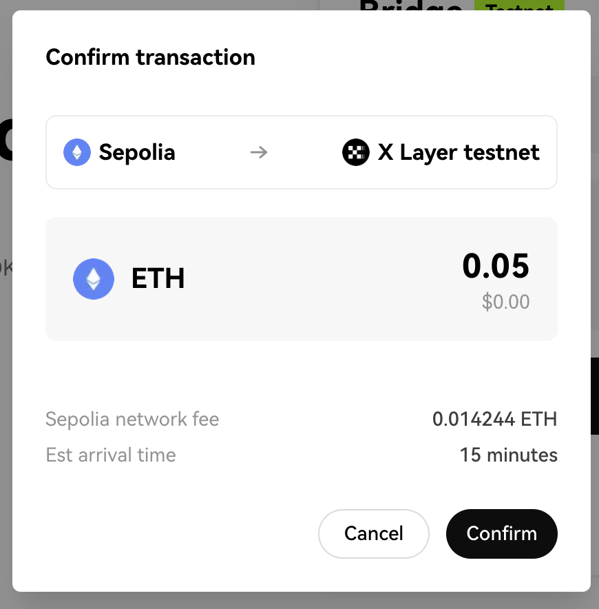
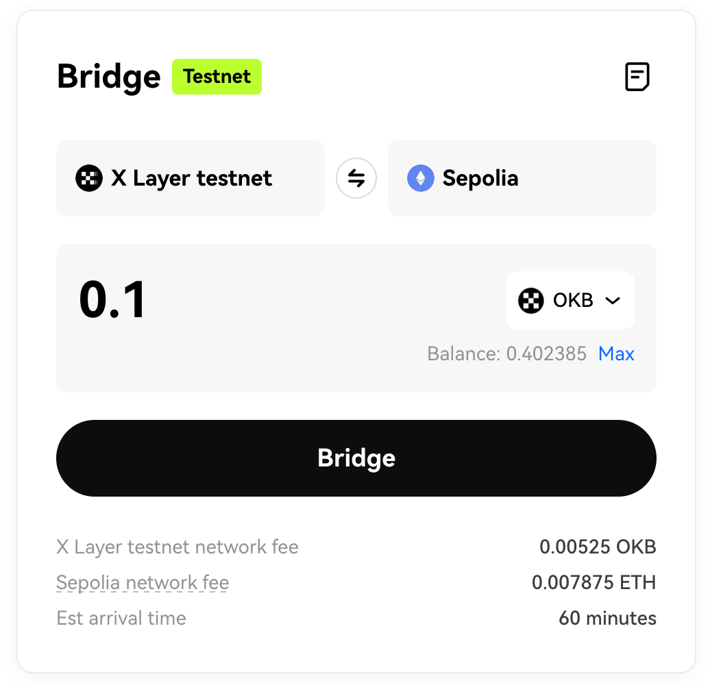
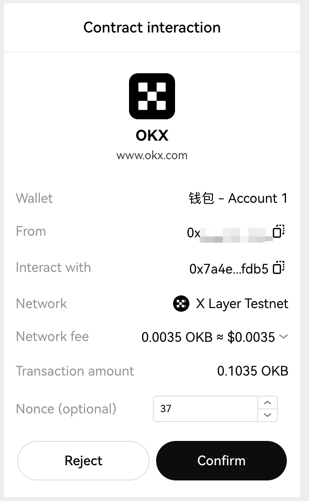
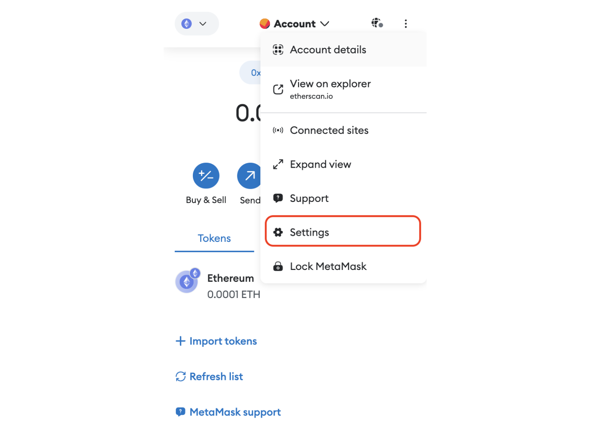

# Bridge assets (testnet)

## Bridging assets from Sepolia to X Layer testnet
You can follow this step-by-step guide to learn how to bridge assets from Ethereum Sepolia testnet to X Layer testnet.
1. Enter the [X Layer bridge testnet page](https://www.okx.com/xlayer/bridge-test "X Layer bridge testnet page"), then select **Sepolia** (left) and **X Layer testnet** (right) as the two bridging directions, as shown below:

2. Click the **Connect wallet** button to connect your wallet:

3. Select the token you need to bridge (ETH is used as an example here), enter the amount, then click the **Bridge** button:

<Tip title="Note">Please note that you need to reserve some ETH for Sepolia network fee.</Tip>

4. Check the bridge transaction details, then click the **Confirm** button:

5. Double check the transaction again in your wallet. Please wait a few moments for your transaction to be processed:

6. Your pending transactions will now appear towards the bottom of your screen. You can also click the **View all transactions** button to view all of the bridge transactions you have made thus far:

## Bridging assets from X Layer testnet to Sepolia
You can follow this step-by-step guide to learn how to bridge assets from X Layer testnet to Ethereum Sepolia testnet.
1. Enter the [X Layer bridge testnet page](https://www.okx.com/xlayer/bridge-test "X Layer bridge testnet page"), then select **X Layer testnet*** (left) and **Sepolia** (right) as the two bridging directions, as shown below:

2. Click the **Connect wallet** button, and switch to X Layer testnet (if you have not added X Layer testnet yet, please add it first):

3. Select the token you need to bridge (OKB is used as an example here), enter the amount, then click the **Bridge** button:

 <Tip title="Note">Please note that you need to reserve some OKB for X Layer testnet network fee.</Tip>

4. Check the bridge transaction details, then click the **Confirm** button:

5. Double check the transaction again in your wallet. Please wait a few moments for your transaction to be processed:

6. Your pending transactions will now appear towards the bottom of your screen. You can also click the **View all transactions** button to view all of the bridge transactions you have made thus far:

7. Click the **Claim** button (bottom right), and switch your wallet to the Sepolia network. Confirm the transaction in your wallet, then wait for your funds to arrive:

## FAQ
### How to clear your account activity/reset account in MetaMask？
You should only clear your account activity when strictly necessary, most often to **resolve stuck and pending transactions**. 

This function is intended primarily for developers, who may find it useful to clear an account’s activity on a test network while continuing to use the same account. 

Note that clearing account activity **only affects the current network**. For example: if you’re on **X Layer testnet**, the only activity that will be cleared are your transactions on **X Layer testnet**. Transactions on other networks, such as Ethereum, will be unaffected.

 <Tip title="Note">Clearing your activity is irreversible, and not a common requirement for most users.*You will not lose value in your accounts*.</Tip>

**To reset the account**:
1. Click the three vertical dots in the top-right corner, and then go to **Settings** > **Advanced**.

2. Scroll down to the **Clear activity and nonce data** section and click the **Clear activity tab data** button.

### How to reset the account in OKX wallet？
You should only reset your account activity when strictly necessary, most often to **resolve stuck and pending transactions**.

This function is intended primarily for developers, who may find it useful to clear an account’s activity on a test network while continuing to use the same account. 

Note that resetting your wallet means restoring your OKX wallet to its initial state, and wiping out **all the seed phrases**, **private keys**, and **wallet data**. Once the reset is complete, **you need to reimport your existing wallet in order to continue using it**.

<Tip title="Note">Before resetting your account, you need to **back up your wallet**, or you *will lose value in your accounts*. For specific operations, please refer to this [OKX Wallet guide](https://www.okx.com/help/how-do-i-manage-my-wallet-web "OKX Wallet guide").</Tip>

**To rest the account**:
1. Click the button in the top-right corner, and then go to **Settings** > **Wallet security**.

2. Click the **Reset wallet** button.

## Resources
### X Layer mainnet info

## Connecting to X Layer (Mainnet)
You can add X Layer mainnet by inputting the following network info:
|Properties|Network details|
|:----|:----|
|Network name|X Layer mainnet|
|RPC URL|https://rpc.xlayer.tech|
|Chain ID|196|
|Token symbol|OKB|
|Block explorer URL|https://www.okx.com/web3/explorer/xlayer|

### X Layer testnet info
|Properties|Network details|
|:----|:----|
|Network name|X Layer testnet|
|RPC URL|https://testrpc.xlayer.tech/terigon|
|Chain ID|1952|
|Token symbol|OKB|
|Block explorer URL|https://www.okx.com/web3/explorer/xlayer-test|

## Faucet links
* **X Layer testnet faucet**：https://web3.okx.com/zh-hans/xlayer/faucet/xlayerfaucet