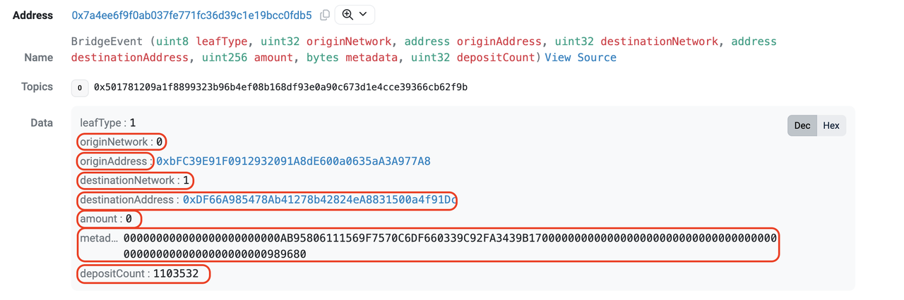
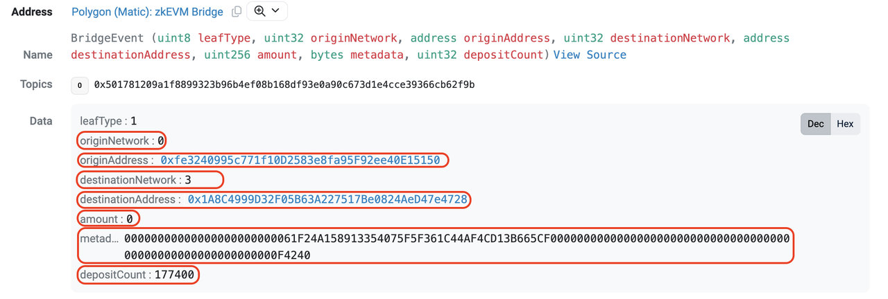

# Bridging USDC workflow

## Contracts

1. [BridgedWrapped USDC](https://zkevm.polygonscan.com/address/0xA8CE8aee21bC2A48a5EF670afCc9274C7bbbC035 "Bridged Wrapped USDC") (ZKEVM)<br/>The existing token for USDC in zkEVM, created by the Polygon ZkEVMBridge using the default TokenWrapped ERC20 contract known as **USDC.e**. It is **BWUSDC** in the flowchart.

2. [USDC-e](https://zkevm.polygonscan.com/address/0x37eAA0eF3549a5Bb7D431be78a3D99BD360d19e5 "USDC-e") (ZKEVM) <br/>
"Native" USDC in ZKEVM known as known as **USDC**. This contract matches the current USDC contract deployed on Ethereum, with all expected features. The contract address is different from the current "bridge wrapped" USDC in use today, and has the ability to issue and burn tokens as well as "blacklist" addresses. [See USDC-e project](https://github.com/omnifient/usdc-e "USDC-e project").

3. [L1Escrow](https://etherscan.io/address/0x70E70e58ed7B1Cec0D8ef7464072ED8A52d755eB) (L1) <br/>
This contract receives layer 1 USDC from users, and triggers the ZKMinterBurner contract on ZKEVM (through the Polygon ZKEVM Bridge) to mint USDC-e. It holds all of the layer 1 backing of USDC-e. It’s also triggered by the Bridge to withdraw layer 1 USDC.

4. [ZKMinterBurner](https://zkevm.polygonscan.com/address/0xBDa0B27f93B2FD3f076725b89cf02e48609bC189 "ZKMinterBurner") (ZKEVM) <br/>
This contract receives BridgeWrappedUSDC on ZKEVM and mints back USDC-e. It also has a permissionless publicly callable function called "migrate" which withdraws all BridgedWrappedUSDC to layer 1 through the Bridge. The beneficiary address is the L1Escrow, thus migrating the supply and settling the balance.

## Bridge transactions guide

Bridge USDC (layer 1) to USDC-e (layer 2)

1. Approve USDC amount for L1Escrow on layer 1 using our [bridge](https://www.okx.com/xlayer/bridge "xlayer bridge").
2. bridgeToken on layer 1.
3. claimMessage on layer 2.

Bridge USDC-e (layer 2) to USDC(layer 1)

1. Approve USDC-e amount for ZKMinterBurner our [bridge](https://www.okx.com/xlayer/bridge "xlayer bridge").
2. bridgeToken on layer 2.
3. claimMessage on layer 1.

Bridge USDC (layer 1) to BWUSDC (layer 2)

1. Approve USDC amount for ZKEVMBridge on layer 1.
2. bridgeAsset on layer 1.
3. claimAsset (BWUSDC) on layer 2.

Convert BWUSDC (layer 2) to USDC-e (layer 2)

1. Approve BWUSDC amount for NativeConverter on layer 2.
2. Convert on layer 2.

Migrate BWUSDC (layer 2) to USDC (layer 1)

1. Migrate on layer 2.
2. claimAsset on layer 1.

## Transaction description

## Layer 1 transactions

1. `bridgeToken`
    - Calldata:

``` 
    function bridgeToken(
        address destinationAddress, //indicate your address on layer 2
        uint256 amount, //amount of usdc
        bool forceUpdateGlobalExitRoot //true
    ) external;
```
   - To: L1Escrow Address on layer 1
   - Description: Transfers USDC to L1Escrow and sends a bridgeMessage to the ZKEVMBridge on layer 2.


2. `claimMessage`
    - Calldata:

``` 
    function claimMessage(
        bytes32[32] calldata smtProofLocalExitRoot,
        bytes32[32] calldata smtProofRollupExitRoot,
        uint256 globalIndex,
        bytes32 mainnetExitRoot,
        bytes32 rollupExitRoot,
        uint32 originNetwork,
        address originAddress,
        uint32 destinationNetwork,
        address destinationAddress,
        uint256 amount,
        bytes calldata metadata
    ) external;
```
   - To: Bridge address on layer 1
   - Description: Claims ZKMinterburner’s message and initiates callback to L1Escrow to release escrowed USDC.
    - Steps for construction of arguments are shown in the section below.

3. `approve`
    - Calldata:

``` 
function approve(address spender, uint256 amount) external returns (bool);
```
   - To: USDC address on layer 1
   - Description: Provides allowance to the L1Escrow to allow "pulling" of tokens。

## Layer 2 transactions

1. `bridgeToken`
    - Calldata:

``` 
    function bridgeToken(
        address destinationAddress, //indicate your address on layer 2
        uint256 amount, //amount of usdc
        bool forceUpdateGlobalExitRoot //true
    ) external;
```
   - To: ZKMinterBurner Address on layer 2
   - Description: Transfers USDC-e to ZKMinterBurner and sends a bridgeMessage to the L1Escrow on L1.

2. `claimMessage`
    - Calldata:

``` 
    function claimMessage(
        bytes32[32] calldata smtProofLocalExitRoot,
        bytes32[32] calldata smtProofRollupExitRoot,
        uint256 globalIndex,
        bytes32 mainnetExitRoot,
        bytes32 rollupExitRoot,
        uint32 originNetwork,
        address originAddress,
        uint32 destinationNetwork,
        address destinationAddress,
        uint256 amount,
        bytes calldata metadata
    ) external;
```
   - To: Bridge Address on layer 2
   - Description: Claims L1Escrow’s message and initiates callback to ZKMinterBurner to mint USDC-e.
    - Steps for construction of arguments are shown in the section below.

3. `approve`
    - Calldata:

```
function approve(address spender, uint256 amount) external returns (bool);

```
   - To: USDC-e / BWUSDC Address on layer 2
   - Description: provides allowance to the ZKMinterburner/NativeConverter to allow "pulling" of tokens.

4. `convert`
    - Calldata:

```
    function convert(
        address receiver,
        uint256 amount,
        bytes calldata permitData
    ) external;
```
   - To: NativeConverter Address on layer 2
   - Description: Transfers BWUSDC to NativeConverter and mints USDC-e into receiver’s wallet.

5. `migrate`
    - Calldata:

```
function migrate() external;
```
   - To: NativeConverter Address on layer 2
   - Description: Approves bridge for token pulling and calls bridgeAsset to bridge BWUSDC to the L1Escrow.

## Extracting ClaimMessage Arguments

Event details from bridgeToken

1. After submission of `bridgeToken` transactions, a `BridgeEvent` is emitted by the bridge, which contains fields that are required for construction of claims to the bridge.
2. `originNetwork`, `originAddress`, `destinationNetwork`, `destinationAddress`, `amount` and `metadata` can be used as is for claimMessage. Deposit count will be used in the subsequent step to extract the other details
3. Samples of BridgeEvent:
    - Emitted from a testnet layer 1 to layer 2 bridgeToken [transaction](https://sepolia.etherscan.io/tx/0xcec854f18b42d9d4600dcbe5c5bc699fb4241f896d5bc5c6ffec2cb882025664#eventlog "bridgeToken transaction").



- Mainnet
  - Emitted from a Mainnet L1 to L2 bridgeToken [transaction](https://etherscan.io/tx/0x37595a26cc411f858be72f3e20b037a735b44214d1530b471414ff88c0bbf6b6#eventlog "Mainnet bridgeToken txn").
  - Notices: `originNetwork`= 0 (Ethereum), destinationNetwork= 3 (X Layer mainnet)



## Extraction from backend

1. `GET` request endpoint:
``` https://<env-specific-domain>/priapi/v1/ob/bridge/merkle-proof?net_id=<networkId>&deposit_cnt=<depositCount> ```

   - Replace `<env-specific-domain>` with the suitable domains, to access XLayer Bridge Service listed below:
    - Testnet: testrpc.x1.tech
    - Mainnet: rpc.xlayer.tech
   -    - Replace the `<networkId>` and `<depositCount>` with a suitable networkId and depositCount (from bridgeEvent).

2. Example requests
      - Testnet
    - Intent: Claiming a bridgeToken call sent from layer 1 with a depositCount of 1103532 
      - https://testrpc.x1.tech/priapi/v1/ob/bridge/merkle-proof?net_id=0&deposit_cnt=1103532
    - Intent: Claiming a bridgeToken call sent from layer 2 with a depositCount of 776346
      - https://testrpc.x1.tech/priapi/v1/ob/bridge/merkle-proof?net_id=1&deposit_cnt=776346
  - Mainnet
    - Intent: Claiming a bridgeToken call sent from layer 1 with a depositCount of 177400
      - https://rpc.xlayer.tech/priapi/v1/ob/bridge/merkle-proof?net_id=0&deposit_cnt=177400
    - Intent: Claiming a bridgeToken call sent from layer 2 with a depositCount of 12
      - https://rpc.xlayer.tech/priapi/v1/ob/bridge/merkle-proof?net_id=3&deposit_cnt=12

3. Response
  - From the response:
    - proof.merkle_proof -> `smtProofLocalExitRoot`
    - proof.rollup_merkle_proof -> `smtProofRollupExitRoot`
    - proof.main_exit_root -> `mainnetExitRoot`
    - proof.rollup_exit_root -> `rollupExitRoot`

```
{
    "proof": {
        "merkle_proof": [
            "0xad4dedfb9e675baf12ae2e011ed63d54b2df94ee30e9cce99d24431a43439818",
            "0x11e7d73d325a8c45e923e5d4b09e79242d992c4fa3c7b08b7519e4972171b801",
            "0xbbcfa0d86ed2a53267ad42b5fbd44c60c3f8799bc499095bba93008c3e28a968",
            "0xb72ab7e87aa54b0d92f9c05bba3227dbfb841c44e055c701ec80a0fe9f4b663a",
            "0xf7da33af5fc0269bd77ddc88db93148ffad3f17157e40b228efe98ce8c76876a",
            "0x0a0857b9d41cae393b7e50106f553110f7edef1aa0b83d40618ef94167afddd9",
            "0x1ad18151ece24b88a96a5637752fe7c0c05d2de70d167b543b84805b3f20e41f",
            "0xffd70157e48063fc33c97a050f7f640233bf646cc98d9524c6b92bcf3ab56f83",
            "0x9867cc5f7f196b93bae1e27e6320742445d290f2263827498b54fec539f756af",
            "0xcefad4e508c098b9a7e1d8feb19955fb02ba9675585078710969d3440f5054e0",
            "0xf9dc3e7fe016e050eff260334f18a5d4fe391d82092319f5964f2e2eb7c1c3a5",
            "0x15f7176f72c2565f84c74c3724b3d3a604cf35b4025738dd0dbacb935f56ccf1",
            "0x3490c6ceeb450aecdc82e28293031d10c7d73bf85e57bf041a97360aa2c5d99c",
            "0xc1df82d9c4b87413eae2ef048f94b4d3554cea73d92b0f7af96e0271c691e2bb",
            "0x6253539cd7256cc1219c4c1567dc5117133ded74246cf5e39c71478cb9dc61a7",
            "0xa3fe99ab72b5fd1b55ebbcd44cd962e5638d2bb4b4959ee5bcef4845dd561779",
            "0x0ab52f279459cb7788f5aef6d2457ee4175e525aeb488dcc0345029c7b54f168",
            "0x29221f43f7a2eee4b69b6d7d152f0ba5ec50e75f0cb1bc9c38e5f18aa065650b",
            "0x5a2dce0a8a7f68bb74560f8f71837c2c2ebbcbf7fffb42ae1896f13f7c7479a0",
            "0x9f054ebab2ee57f0c205353c5f4aba3e442ac4d4c09119801587928b85471765",
            "0xc65e9645644786b620e2dd2ad648ddfcbf4a7e5b1a3a4ecfe7f64667a3f0b7e2",
            "0xf4418588ed35a2458cffeb39b93d26f18d2ab13bdce6aee58e7b99359ec2dfd9",
            "0x5a9c16dc00d6ef18b7933a6f8dc65ccb55667138776f7dea101070dc8796e377",
            "0x4df84f40ae0c8229d0d6069e5c8f39a7c299677a09d367fc7b05e3bc380ee652",
            "0xcdc72595f74c7b1043d0e1ffbab734648c838dfb0527d971b602bc216c9619ef",
            "0x0abf5ac974a1ed57f4050aa510dd9c74f508277b39d7973bb2dfccc5eeb0618d",
            "0xb8cd74046ff337f0a7bf2c8e03e10f642c1886798d71806ab1e888d9e5ee87d0",
            "0x838c5655cb21c6cb83313b5a631175dff4963772cce9108188b34ac87c81c41e",
            "0x662ee4dd2dd7b2bc707961b1e646c4047669dcb6584f0d8d770daf5d7e7deb2e",
            "0x388ab20e2573d171a88108e79d820e98f26c0b84aa8b2f4aa4968dbb818ea322",
            "0x93237c50ba75ee485f4c22adf2f741400bdf8d6a9cc7df7ecae576221665d735",
            "0x8448818bb4ae4562849e949e17ac16e0be16688e156b5cf15e098c627c0056a9"
        ],
        "rollup_merkle_proof": [
            "0x0000000000000000000000000000000000000000000000000000000000000000",
            "0xad3228b676f7d3cd4284a5443f17f1962b36e491b30a40b2405849e597ba5fb5",
            "0xb4c11951957c6f8f642c4af61cd6b24640fec6dc7fc607ee8206a99e92410d30",
            "0x21ddb9a356815c3fac1026b6dec5df3124afbadb485c9ba5a3e3398a04b7ba85",
            "0xe58769b32a1beaf1ea27375a44095a0d1fb664ce2dd358e7fcbfb78c26a19344",
            "0x0eb01ebfc9ed27500cd4dfc979272d1f0913cc9f66540d7e8005811109e1cf2d",
            "0x887c22bd8750d34016ac3c66b5ff102dacdd73f6b014e710b51e8022af9a1968",
            "0xffd70157e48063fc33c97a050f7f640233bf646cc98d9524c6b92bcf3ab56f83",
            "0x9867cc5f7f196b93bae1e27e6320742445d290f2263827498b54fec539f756af",
            "0xcefad4e508c098b9a7e1d8feb19955fb02ba9675585078710969d3440f5054e0",
            "0xf9dc3e7fe016e050eff260334f18a5d4fe391d82092319f5964f2e2eb7c1c3a5",
            "0xf8b13a49e282f609c317a833fb8d976d11517c571d1221a265d25af778ecf892",
            "0x3490c6ceeb450aecdc82e28293031d10c7d73bf85e57bf041a97360aa2c5d99c",
            "0xc1df82d9c4b87413eae2ef048f94b4d3554cea73d92b0f7af96e0271c691e2bb",
            "0x5c67add7c6caf302256adedf7ab114da0acfe870d449a3a489f781d659e8becc",
            "0xda7bce9f4e8618b6bd2f4132ce798cdc7a60e7e1460a7299e3c6342a579626d2",
            "0x2733e50f526ec2fa19a22b31e8ed50f23cd1fdf94c9154ed3a7609a2f1ff981f",
            "0xe1d3b5c807b281e4683cc6d6315cf95b9ade8641defcb32372f1c126e398ef7a",
            "0x5a2dce0a8a7f68bb74560f8f71837c2c2ebbcbf7fffb42ae1896f13f7c7479a0",
            "0xb46a28b6f55540f89444f63de0378e3d121be09e06cc9ded1c20e65876d36aa0",
            "0xc65e9645644786b620e2dd2ad648ddfcbf4a7e5b1a3a4ecfe7f64667a3f0b7e2",
            "0xf4418588ed35a2458cffeb39b93d26f18d2ab13bdce6aee58e7b99359ec2dfd9",
            "0x5a9c16dc00d6ef18b7933a6f8dc65ccb55667138776f7dea101070dc8796e377",
            "0x4df84f40ae0c8229d0d6069e5c8f39a7c299677a09d367fc7b05e3bc380ee652",
            "0xcdc72595f74c7b1043d0e1ffbab734648c838dfb0527d971b602bc216c9619ef",
            "0x0abf5ac974a1ed57f4050aa510dd9c74f508277b39d7973bb2dfccc5eeb0618d",
            "0xb8cd74046ff337f0a7bf2c8e03e10f642c1886798d71806ab1e888d9e5ee87d0",
            "0x838c5655cb21c6cb83313b5a631175dff4963772cce9108188b34ac87c81c41e",
            "0x662ee4dd2dd7b2bc707961b1e646c4047669dcb6584f0d8d770daf5d7e7deb2e",
            "0x388ab20e2573d171a88108e79d820e98f26c0b84aa8b2f4aa4968dbb818ea322",
            "0x93237c50ba75ee485f4c22adf2f741400bdf8d6a9cc7df7ecae576221665d735",
            "0x8448818bb4ae4562849e949e17ac16e0be16688e156b5cf15e098c627c0056a9"
        ],
        "main_exit_root": "0x4b0b384f00c67749afa0a67d288cd5bd6a7906c6a3dad50d0d896617b0bb3b5e",
        "rollup_exit_root": "0xa329b2209dcf1a881c4e5751820cfb9bda52b8a9ff7a0a9219a3017455640af2"
    }
}
```

## Construction of globalIndex
1. Layout of globalIndex

```
     * @param globalIndex Global index is defined as:
     * | 191 bits |    1 bit     |   32 bits   |     32 bits    |
     * |    0     |  mainnetFlag | rollupIndex | localRootIndex |
     //concatenating all of the bits above form the globalIndex
     
```

2. Description
  - `mainnetFlag`
    - Boolean to represent whether the message originated from layer 1
  - `rollUpIndex`
    - Index of the rollup, according to the RollupManager if mainnet flag is 0 
    - Bridge contract on testnet and mainnet are on different forks, and as such will require different handling
    - Mainnet - Running UB version of the contract, rollupIndex is `networkId - 1`.
      - E.g. For XLayer mainnet, networkId is 3, rollUpIndex to provide is 2
    - Testnet - Running an older fork of the contract, networkID is 1, but the contract does not verify the exact rollUpIndex
      - E.g. For XLayer testnet, networkId is 1, but the rollUpIndex accepts 0
  - `localRootIndex`
    - depositCount extracted from step 1.

3. Examples of globalIndex
  - Testnet
    - layer 1 to layer 2 bridgeToken transaction claim, depositCount of 1103532.
      - 18446744073710655148(decimal) - 0x000000000000000000000000000000000000000000000001000000000010d6ac(hex)
    
    - layer 2 to layer 1 bridgeToken transaction claim, depositCount of 772142.
      - 772142(decimal) - 0x00000000000000000000000000000000000000000000000000000000000bc82e(hex)
  - Mainnet
    - layer 1 to layer 2 bridgeToken transaction claim, depositCount of 177400.
      - 18446744073709729016(decimal) - 0x000000000000000000000000000000000000000000000001000000000002b4f8(hex)
    
    - layer 2 to layer 1 bridgeToken transaction claim, depositCount of 12.
      - 8589934604(decimal) - 0x000000000000000000000000000000000000000000000000000000020000000C(hex)

## Addresses

## Sepolia testnet

|Name|Address|
|:----|:----|
|L1Escrow|0x426840dE56a73C8Cfd09996c128dd18ff90BA666|
|USDC|0x13fA158A117b93C27c55b8216806294a0aE88b6D|
|Bridge|0x7a4Ee6f9F0aB037fE771FC36D39C1E19bcc0Fdb5|

## X Layer testnet

|Name|Address|
|:----|:----|
|USDC.e (BWUSDC)|0x426840dE56a73C8Cfd09996c128dd18ff90BA666|
|USDC (USDC-e)|0xe8926a7f935675e95c4881a0FFBb84ea320AF6FD|
|ZKMinterBurner|0x8AEACF2eBB6b24f8dE234E919f2696F76e3d91C2|
|NativeConverter|0xf3c0330Edf50Aa0c3D04b05feE585D42c1fCE27E|
|Bridge|0x7a4Ee6f9F0aB037fE771FC36D39C1E19bcc0Fdb5|

## Ethereum mainnet

|Name|Address|
|:----|:----|
|L1Escrow|0xfe3240995c771f10D2583e8fa95F92ee40E15150|
|USDC|0xA0b86991c6218b36c1d19D4a2e9Eb0cE3606eB48|
|Bridge|0x2a3DD3EB832aF982ec71669E178424b10Dca2EDe|

## X Layer mainnet

|Name|Address|
|:----|:----|
|USDC.e (BWUSDC)|0xA8CE8aee21bC2A48a5EF670afCc9274C7bbbC035|
|USDC (USDC-e)|0x74b7F16337b8972027F6196A17a631aC6dE26d22|
|ZKMinterBurner|0x1A8C4999D32F05B63A227517Be0824AeD47e4728|
|NativeConverter|0x9258cCeb28884D7a58e9d485Ec61C30768a23D45|
|Bridge|0x2a3DD3EB832aF982ec71669E178424b10Dca2EDe|