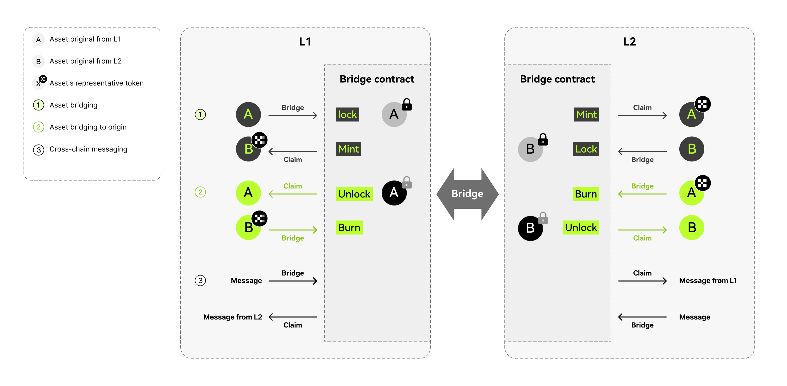
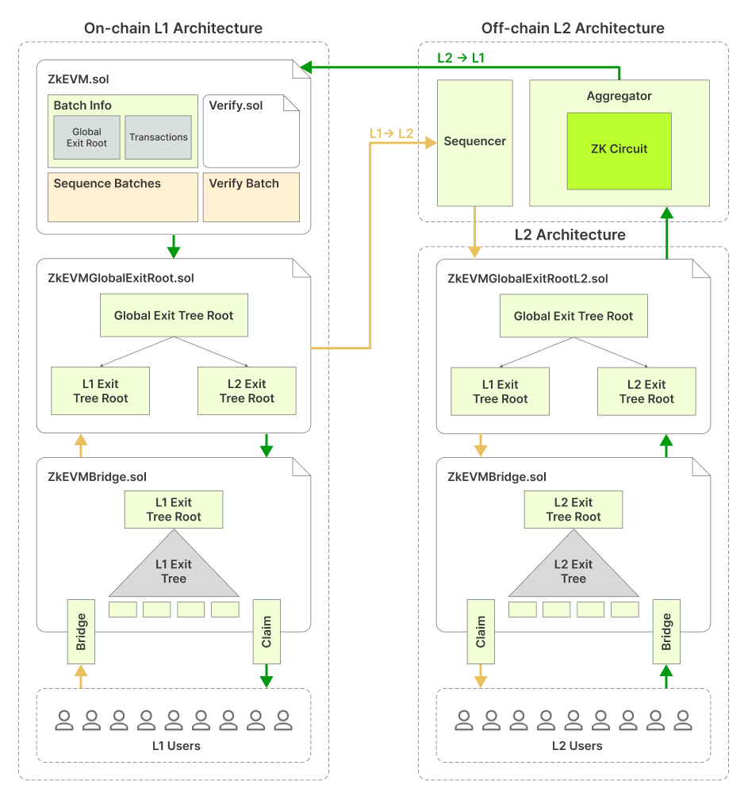

# Flow of assets
The X Layer bridge is a decentralized bridge that enables users to securely transfer assets between layer 1 and layer 2. Here's how it works:
1. To bridge an asset from layer 1 to layer 2, the user must lock the asset in layer 1. The **layer 2 bridge smart contract** will then mint a wrapped token in layer 2, representing an equivalent value of the asset. After the minting process is finished, the user or recipient can claim the asset in layer 2.
2. In the opposite operation, after burning the wrapped token in layer 2, the **layer 1 bridge smart contract** unlocks the original asset in L1.

Asset transferring is enabled by three smart contracts: 
- The bridge smart contract (`ZkEVMBridge.sol`)
- The global exit root manager (`ZkEVMGlobalExitRoot.sol`)
- The consensus contract (`ZkEVM.sol`)

Please refer to the previous document for more detailed information: 
<Card mainTitle="X Layer bridge smart contracts" subTitle='Smart contracts for asset transfer' link="./asset-transfer"/>

## Flow of assets in X Layer bridge
### Asset flow from layer 1 → layer 2
1. The `Bridge` function of the zkEVM bridge smart contract (`ZkEVMBridge.sol`) on the L1 network is invoked. If the bridge request is valid, the bridge smart contract appends an exit leaf to the L1 exit tree and computes the new L1 exit tree root.
2. The Global Exit Root Manager (`ZkEVMGlobalExitRoot.sol`) appends the new L1 exit tree root to the global exit tree and computes the global exit root.
3. The Sequencer fetches the latest global exit root from the global exit root manager.
4. At the start of the transaction batch, the sequencer stores the global exit root in special storage slots of the layer 2 Global Exit Root Manager smart contract (`ZkEVMGlobalExitRootL2.sol`), allowing L2 users to access it.
5. In order to complete the bridging process, the user calls the `Claim` function of the bridge smart contract and provides a Merkle proof to demonstrate that the correct exit leaf was included and represented in the Global Exit Root.
6. The bridge smart contract obtains the layer 2 Global Exit Root Manager smart contract’s global exit root and validates the user’s Merkle proof of inclusion. If the Merkle proof is valid, the bridging process succeeds; otherwise, the transaction fails.

### Asset flow from layer 2 → layer 1

1. The user calls the Bridge function of the zkEVM bridge smart contract (`ZkEVMBridge.sol`) on Layer 2. If the bridge request is valid, the bridge smart contract appends an exit leaf to the L2 Exit Tree and computes the new L2 exit tree root.
2. The L2 Global Exit Root Manager (`ZkEVMGlobalExitRootL2.sol`) is called to append the new layer 2 exit tree root to the global exit tree and compute the global exit root:
<Tip title="Note">For the sake of simplicity, the intermediate step is not depicted in the figure below. That step is: The user’s bridging transaction gets included in one of the batches selected and sequenced by the sequencer.</Tip>
3. The aggregator generates a zk-proof attesting to the computational integrity in the execution of sequenced batches (where one of these batches includes the user’s bridging transaction).
4. For verification purposes, the aggregator sends the zk-proof together with all relevant batch information that leads to the new L2 Exit Tree root (computed in step 2 above), to the consensus contract (`ZkEVM.sol`).
5. The consensus contract utilizes the `verifyBatches` function to verify validity of the received zk-proof. If valid, the consensus contract sends the new L2 Exit Tree Root to the Global Exit Root Manager smart contract (`ZkEVMGlobalExitRoot.sol`) in order to update the Global Exit Tree.
6. In order to complete the bridging process on the L1 network, the user calls the `Claim` function of the bridge smart contract, and provides Merkle proof of the fact that the correct exit leaf was included in the computation of Global Exit Root.
7. The bridge smart contract retrieves the global exit root from the L1 Global Exit Root Manager smart contract and verifies validity of the Merkle proof. If the Merkle proof is valid, the bridge smart contract successfully completes the bridging process. Otherwise, the transaction is reverted.

<Tip title="Note">The architecture shown in the diagram below is simplified, emphasizing the connection between different bridge elements. 
It doesn't include the interaction between the consensus contract and the sequencer, which is discussed in more detail in earlier subsections of this documentation, particularly in the [consensus contract](https://github.com/okx/xlayer-contracts/blob/release/v0.3.0/contracts/v2/consensus/validium/PolygonValidiumEtrog.sol "consensus contract") section.</Tip>