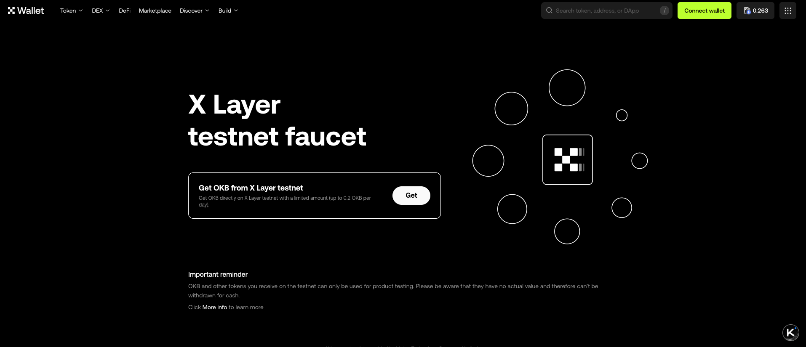
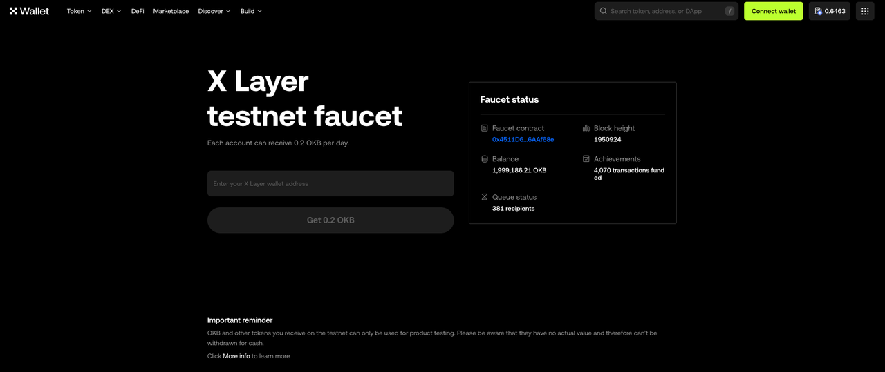

# Get testnet tokens and bridge

Users and developers can receive OKB testnet tokens on X Layer from the official testnet faucet below, max of 0.2 OKB, [here](https://web3.okx.com/xlayer/faucet).
In this guide, we will show the steps on how to receive OKB testnet.

## X Layer official testnet faucet
The X Layer [testnet faucet](https://www.okx.com/xlayer/faucet "faucet") is an official tool provided by the X Layer team for developers to claim test tokens. Developers and users can use X Layer testnet faucet to obtain:
- Testnet OKB tokens 
- Other ERC-20 tokens

<Tip title="Note">
Please note that on the X Layer testnet, each user can only claim 0.2 OKB per day.
</Tip>

1. Head to the X Layer testnet faucet and click on the Get button for the "Get OKB from X Layer testnet" option.

2. Input your wallet address in the field. If you have connected a wallet plugin (EVM network), the field will automatically display your current wallet address. Next, click the Get 0.2 OKB button at the bottom.

## Mint via Sepolia and bridge testnet OKB

Users and developers can also mint testnet OKB on the Sepolia testnet and use the official X Layer [bridge](https://www.okx.com/xlayer/bridge-test "testnet bridge") to bridge OKB. You can also bridge other testnet tokens from Sepolia to the X Layer testnet. To simplify the minting process of testnet OKB on Sepolia testnet, we have also provided the interface to do so through our X Layer testnet faucet [here](https://www.okx.com/xlayer/faucet "faucet").

<Tip title="Note">
Please ensure that your wallet contains enough ETH (Sepolia ETH) for gas fees on the Sepolia network. You can also use the X Layer bridge to bridge ETH to the X Layer testnet.
</Tip>

1. Go to the X Layer testnet faucet official website and click the Get button for the "Mint OKB on Sepolia" option.

2. Connect your wallet plugin and switch your wallet network to Sepolia. If you have insufficient ETH, you can click the Get Sepolia ETH button to obtain ETH from a third-party faucet.

3. Select the token you want to receive and enter the quantity. Then, click the Mint button at the bottom.

