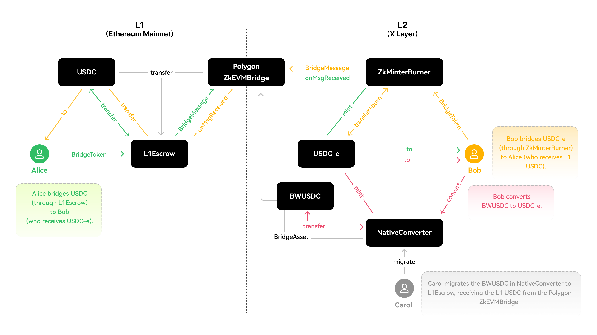

# USDC on X Layer

## The difference between USDC and USDC.e

## USDC
Circle introduced the [Bridged USDC Standard](https://www.circle.com/en/bridged-usdc "Circle Doc") to ensure that chain operators can easily deploy a form of bridged USDC that is capable of being upgraded in-place by Circle to native USDC, if and when appropriate, and prevent any fragmentation problems. X Layer official bridge and OKX Exchange has supported this USDC following Circle Bridged standard. It is USDC-e in the flowchart.

|Asset|X Layer mainnet address|
|:----|:----|
|USDC|0x74b7f16337b8972027f6196a17a631ac6de26d22|

## USDC.e
There also exists a “bridged” form of USDC known as USDC.e, which is USDC that has been bridged from Ethereum issued by X Layer. It is BWUSDC in the flowchart.

|Asset|X Layer mainnet address|
|:----|:----|
|USDC.e|0xA8CE8aee21bC2A48a5EF670afCc9274C7bbbC035|

## Using USDC on X Layer

<Tip title="Note">Whether you are a developer or a user, we recommend that you use **USDC on X Layer**.</Tip>

## For users
Users can get USDC on the X Layer mainnet in these ways:

1. Using X Layer official bridge

When you bridge USDC from Ethereum to the X Layer by [official bridge user interface](https://www.okx.com/xlayer/bridge "XLayer bridge"), you can automatically receive USDC on the X Layer.

2. Using OKX exchange

[OKX](https://www.okx.com/ "OKX") now supports USDC (not USDC.e) deposits and withdrawals.

3. Using third-party bridges

Some well known bridges are integrating with X Layers. 

## For developers
Please refer to the USDC workflow section.

