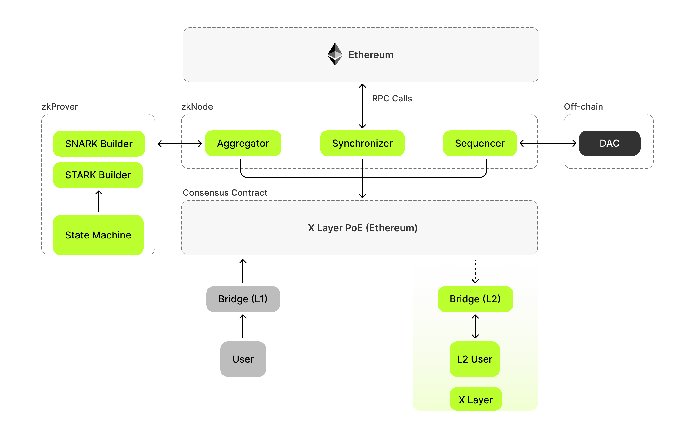

# X Layer overview

X Layer is a cutting-edge Ethereum layer 2 (L2) network built by OKX and Polygon using Polygon's CDK. It offers full compatibility with the Ethereum Virtual Machine (EVM), enabling developers to deploy existing Ethereum applications and develop new, innovative projects at a fraction of the cost compared to doing so on Ethereum. X Layer also enables users to use dapps at significantly lower gas fees and faster speed compared to Ethereum.

X Layer's underlying architecture is an EVM validium with Pessimistic Proof (PP) based cross‑chain finality. Transactions on X Layer are executed and validated by the EVM; ZK proofs are not used to secure intra‑L2 transactions. Instead, Polygon's PP system is only used when bridging/cross‑chain to provide verifiable finality on L1 or other domains. This differs from rollups (ZK or OP), and offers the following benefits:
- **Significantly lower fees**, since they don't consume expensive Ethereum gas, i.e., blockspace to store transaction data.
- **Significantly higher scalability**, since validium throughput is not bounded by the L1 data publication limit used by rollups.

For more detailed information, you can check out the X Layer architecture below.

## X Layer architecture
The major components of X Layer are:
- **Virtual Machine**: EVM‑equivalent
- **Mode**: Validium
- **Data Availability**: Data Availability Committee (DAC)
- **Consensus**: Polygon Pessimistic Consensus ([PolygonPessimisticConsensus.sol](https://github.com/okx/xlayer-contracts/blob/upstream/v9.0.0-rc.3-pp/contracts/v2/consensus/pessimistic/PolygonPessimisticConsensus.sol))
- **Sequencer**: Trusted
- **Gas token**: OKB

## Background
X Layer has migrated to the Pessimistic Proof (PP) mode introduced by Polygon. In PP mode, the L2 chain runs as an EVM validium (trusted sequencers, DAC for data availability), and PP is used only for cross‑chain settlement (e.g., withdrawals) to provide verifiable finality on L1.

## Architecture diagram and flow (PP mode)
Below follows the numbering in the diagram (coarse‑grained, simplified wording):

- 1.x User Tx path on L2
  - 1.1 User sends Tx → 1.2 Proxyd relays to Erigon RPCs
  - 1.3 RPCs route Tx to Pool Manager / other APIs
  - 1.4 Pool Manager pushes Tx to Sequencer pool；1.5 RPCs monitor receipts
  - 1.6 Sequencer writes Tx records to DB（Postgres）
- 2.x Sequencing, data and DS
  - 2.1 RPC gets Tx；2.2 Sequencer generates block
  - 2.3 Write chain data；2.5 Write DS data；2.6 DS Relay pushes DS；2.7 DS Relay writes DS DB；2.8 RPCs push DS
- 3.x/4.x Certificate & PP pipeline
  - 4.1 aggSender fetches blocks；4.2 Double‑check
  - 4.3 Send certificate to agglayer；4.4 agglayer submits PP to L1
- 5.x Contract event sync
  - 5.1 Bridge Service syncs L2 contract events
  - 5.2 Sync L1 contract events

Outcome: execution/finality happens quickly on L2; for cross‑chain actions, a certificate + PP is produced and verified on L1 to finalize withdrawals/messages.

This flow ensures fast execution on L2 while providing cryptographic settlement for cross‑chain operations without publishing full L2 data to L1.

## X Layer Validium & Pessimistic Proofs (PP)
X Layer is built with Polygon CDK, an advanced open‑source framework designed for the rapid deployment of EVM L2 blockchains on [Ethereum](https://ethereum.org/en/ "Ethereum").

X Layer adopts the validium mode and implements a dedicated committee of sequencers, delivering a high‑performance L2 scaling solution that maintains interoperability with other Polygon chains.

Since transaction data is not stored on the Ethereum mainnet, it is both executed and stored off‑chain, which massively enhances scalability. Validium reduces L1 gas storage costs, hence reducing transaction costs for users on L2, with a prominent enhancement in user privacy and user experience.

For cross‑chain operations (for example, withdrawals and bridge messages), X Layer leverages Polygon's Pessimistic Proof (PP). PP produces a succinct proof that the claimed state transition is valid with respect to L2, enabling secure settlement on L1 without publishing full L2 transaction data.

## Validium vs. Rollups
Validiums differ from rollups and sidechains because they only share a proof of validity when needed (e.g., via PP for cross‑chain), which confirms the results of the transactions with Ethereum, not the actual transaction data of the executed transactions.
Here is how it operates: a verifier/bridge smart contract is deployed on Ethereum. For cross‑chain operations, the Polygon side `agglayer` submits a PP (ZK) certificate/proof to this contract on behalf of X Layer. The proof attests to the L2 state transition result but not the full transaction data.

The verifier contract assesses the validity of the submitted PP. If it is invalid, the claim is rejected and not stored/processed on Ethereum.

## Consensus & finality
X Layer uses a PoE‑based consensus on L2. Transactions are executed by the EVM and finalized on L2 by the trusted sequencer set. Cross‑chain finality is handled by the Polygon‑side `agglayer` subsystem: xlayer generates and stores certificate data (metadata/epochs), `aggsender` syncs and submits certificates to `agglayer`, and `agglayer`/`agglayer‑prover` submits PP proofs on L1. The two key flows are: **L2 block production & data writes** and **cross‑chain certificate + PP submission**. Participants include **Sequencer** and the **aggsender/agglayer** pipeline.

**Sequencer**: responsible for batching transactions on L2, producing blocks, and writing chain data.

**aggsender/agglayer**: `aggsender` fetches blocks/certificates from the node side, performs double‑check, and syncs the certificate to `agglayer`; `agglayer` (with `agglayer‑prover`) submits PP proofs on L1 to complete cross‑chain settlement.

## Data Availability
X Layer operates in validium mode, where it integrates a secure data availability layer managed by a DAC. Below are the functionalities of DAC:
- Verifies the availability of data associated with specific blockchain blocks
- Ensures data robustness and computational efficiency of X Layer

### Advantages of the DAC provided by Polygon CDK
The DAC primarily provides:
- Lower transaction fees: less computations leads to lower fees
- State privacy: maintaining a secure state change record to ensure data integrity

<Tip title="Note">Check out [Ethereum Foundation’s Data availibilty](https://ethereum.org/en/developers/docs/data-availability/ "Ethereum Foundation’s Data Availibilty") and [Polygon CDK’s Data availability](https://ethereum.org/en/developers/docs/data-availability/ "Polygon CDK’s Data Availability") for more info on DAC.</Tip>

## X Layer node
The X Layer node (based on `xlayer-erigon`) syncs with the L2 state. Trusted sequencers are responsible for managing L2 state and batching, while cross‑chain finality is handled by PP.

<Tip title="Note">For node internals and configuration, see the `xlayer-erigon` repository.</Tip>

## Pessimistic Proofs (PP) for cross‑chain
For bridging and cross‑domain settlement, X Layer integrates Polygon's Pessimistic Proofs. During a withdrawal or cross‑chain message, an aggregator produces a PP that attests to the L2 state at a given checkpoint. This proof is verified by the L1 bridge/verifier contract before funds/messages are released on L1. PP is not used for day‑to‑day L2 transaction execution.

## Tokenomics
There are two main actors on X Layer that earn OKB as reward and pay OKB token as Gas fee for transactions at the same time.
### Sequencers
- Each sequencer is required to pay a fee in OKB tokens to have the privilege of creating and suggesting batches.
- When a sequencer successfully proposes valid batches containing valid transactions, they are rewarded with the fees paid by transaction requestors or network users.

### Aggsender & agglayer
- `aggsender` observes L2 blocks, performs double‑check, and pushes certificates to `agglayer`.
- `agglayer` (with `agglayer‑prover`) generates and submits PP proofs on L1; no PP is required for normal L2 transactions.
- Fees and settlement are tied to certificates that are committed and verified on L1 via `agglayer`.

## Transactions on X Layer
Before making any transactions on layer 2, users need to have OKB on X Layer. Per the latest OKX announcement, to obtain OKB on X Layer you should first deposit Ethereum L1 OKB to OKX Exchange and then use the "Withdraw to X Layer" one‑click swap. Over time, OKX Exchange will discontinue withdrawals of OKB back to Ethereum L1. See the announcement for details: [OKX: PP upgrade of X Layer and OKB gas optimization](https://www.okx.com/zh-hans/help/announcement-on-the-pp-upgrade-of-x-layer-and-optimisation-of-the-okb-gas).
2. Layer 2 transactions：
  - The user starts a transaction from their wallet (e.g., MetaMask) and sends it to a sequencer.
  - Once the sequencer commits to adding the transaction, it becomes finalized on layer 2.
  - At this point, the transaction is settled on layer 2, but its state has not yet propagated to L1. This state is known as the **trusted state**.
  - The sequencer transmits the batch data to a smart contract on L1, permitting any node to synchronize its state from L1 in a secure, trustless manner. This state is referred to as the **virtual state**.
  - The aggregator gathers pending transactions for verification and constructs a proof to attain finality on L1.
  - After the proof undergoes validation, the user’s transactions gain finality on L1, a crucial step for actions like withdrawals. This state is called the **verified state**.
  
To get a sense of the complete transaction life cycle on X Layer, we recommend you to take a look at the [Transactions and data flow](/developer/architecture/transactions-n-data-flow "Transactions and data flow") document.

<Tip title="Note">For more EVM and zkEVM related questions, you can visit [Polygon’s EVM Equivalence FAQ](https://wiki.polygon.technology/docs/zkevm/faq/zkevm-eth-faq/ "Polygon’s EVM Equivalence FAQ") and [General FAQ](https://wiki.polygon.technology/docs/zkevm/faq/zkevm-general-faq/ "General FAQ") for more info.</Tip>