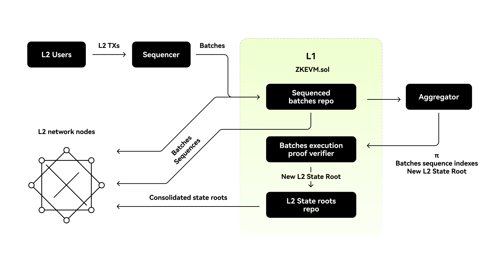

# State management
This document aims to explain how the X Layer protocol manages the L2 rollup's states while providing state transition verifiability and security.

## Trustless L2 state management
The trusted sequencer generates batches for quick L2 transaction finality. Instead of waiting for the next L1 block, these batches are shared with L2 nodes through a broadcast channel. Each node processes the batches locally to compute the L2 state.
After the trusted sequencer commits batch sequences from L1, L2 nodes independently re-execute them, eliminating the need for complete trust. Off-chain batch execution is later verified on-chain using zero-knowledge proofs, and the resulting L2 state root is committed. With zkEVM advancements, L2 nodes sync new L2 state roots directly from L1.

<Tip title="Note">Data Availability and transaction execution verification are based solely on L1 security assumptions. In the protocol's final stage, nodes depend only on L1 data to stay in sync with every L2 state change.</Tip>

In the diagram above, **L2 nodes receive batch data through three methods**:
1. **From the trusted sequencer**: before batches are committed to L1
2. **Directly from L1**: after the batches are sequenced
3. **After verification**: once execution correctness is proven by the aggregator and verified by the `ZkEVM.sol` contract

Worth noting, these three batch data formats arrive in the order mentioned above.