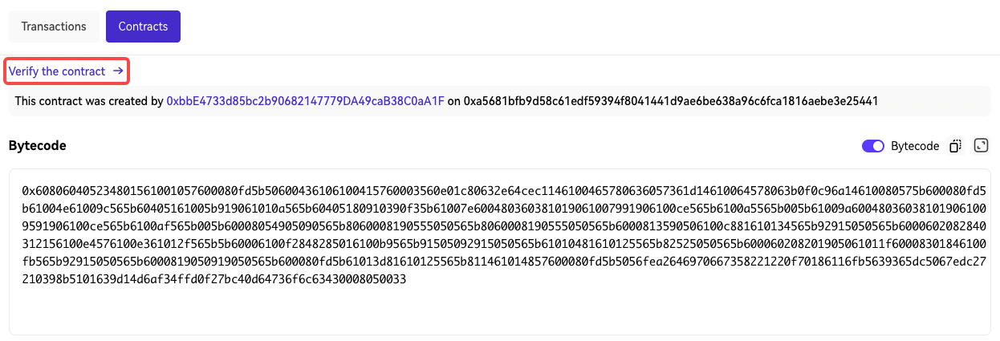

# Manual verification
After deploying a smart contract to zkEVM, it can be verified in various ways depending on the framework of deployment, as well as the complexity of the contract. In this guide, we will provide examples to demonstrate the manual verification of a deployed smart contract.

## Verifying contract manually
After successfully compiling a smart contract, follow the next steps to verify your smart contract.
1. Copy the **Address** to which the smart contract is deployed.
2. Navigate to [OKX Explorer](https://www.okx.com/explorer/ "OKX Explorer") and select **X Layer testnet or mainnet**. Once you are on the right network, paste the contract address into the search box.
3. Now you are on the page that shows your contact address details. Scroll down to select **Contracts** and click on **Verify the contract**.

4. Select **SingleFile** and **Compiler version**.

5. Copy your contract code below and check **Optimization** if it is enabled.

That’s it! You have verified your contract. You will see ✅ **The contract has been verified** under your **Contract** tab.

