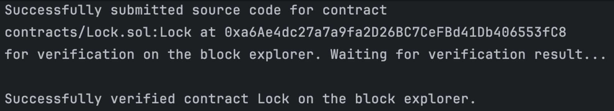

# Verifying with Hardhat
To verify your code on [OKLink](https://www.oklink.com/ "OKLink"), you just need to modify one file (hardhat.config.js), following the same process and commands outlined in [Hardhat](https://hardhat.org/hardhat-runner/docs/guides/verifying "Hardhat")'s official documentation.

## Important notes
1. If you want to verify your code on Etherscan, you'll need to obtain an API key. However, for X Layer verification, you don't need to apply for a separate key, filling it in with any non-empty value is fine.
2. After you deploy your contract code, make sure to wait at least one minute before verifying it.
3. Currently, verifying proxy contracts through Hardhat is not supported. If you need to verify proxy contracts, you will need to manually verify them through a browser.

## Example
1. Start by creating a Hardhat project and using the Lock contract as an example. 
2. Next, modify the `hardhat.config.js` file in your project directory with the following changes.
For X Layer testnet or mainnet:
```solidity
module.exports = {
    solidity: "0.8.9",
    networks: {
        xlayer: {
            url: "https://testrpc.xlayer.tech", //or https://rpc.xlayer.tech for mainnet
            accounts: [process.env.PRIVKEY]
        }
    },
    etherscan: {
        apiKey: process.env.ETHERSCAN_KEY,
        customChains: [
            {
                network: "xlayer",
                chainId: 195, //196 for mainnet
                urls: {
                    apiURL: "https://www.oklink.com/api/v5/explorer/contract/verify-source-code-plugin/XLAYER_TESTNET", //or https://www.oklink.com/api/v5/explorer/contract/verify-source-code-plugin/XLAYER for mainnet
                    browserURL: "https://www.oklink.com/xlayer-test" //or https://www.oklink.com/xlayer for mainnet
                }
            }
        ]
    }
};
```
Replace `process.env.PRIVKEY` with your own deployment address's private key, and `process.env.ETHERSCAN_KEY` can be filled with your OKLink API Key, which can be applied from [My account - API management] on https://www.oklink.com/ for free

3. Compile your Hardhat contract code and deploy it with this command:
```javascript
hh run scripts/deploy.js --network xlayer
```


4. Wait for one to two minutes, and then verify the contract by running the following command and specifying the contract file you want to verify.
```javascript
hh verify --contract contracts/Lock.sol:Lock <address> <unlock time> --network xlayer
```


5. Check if the contract has been successfully verified by visiting  [here](https://www.oklink.com/xlayer-test/address/0xa6Ae4dc27a7a9fa2D26BC7CeFBd41Db406553fC8#code/ "Testnet OKLink") for testnet, or [here](https://www.oklink.com/xlayer/address/0x21F2018Fe98f49C15Fab002f3D4cFBE9D6EeA88b#code "Mainnet OKLink") for mainnet.
