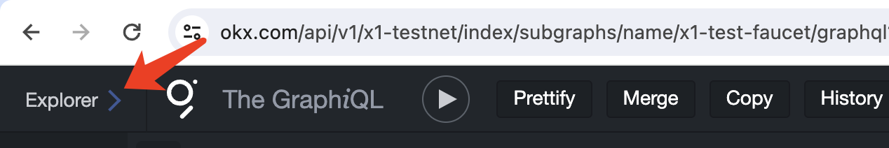
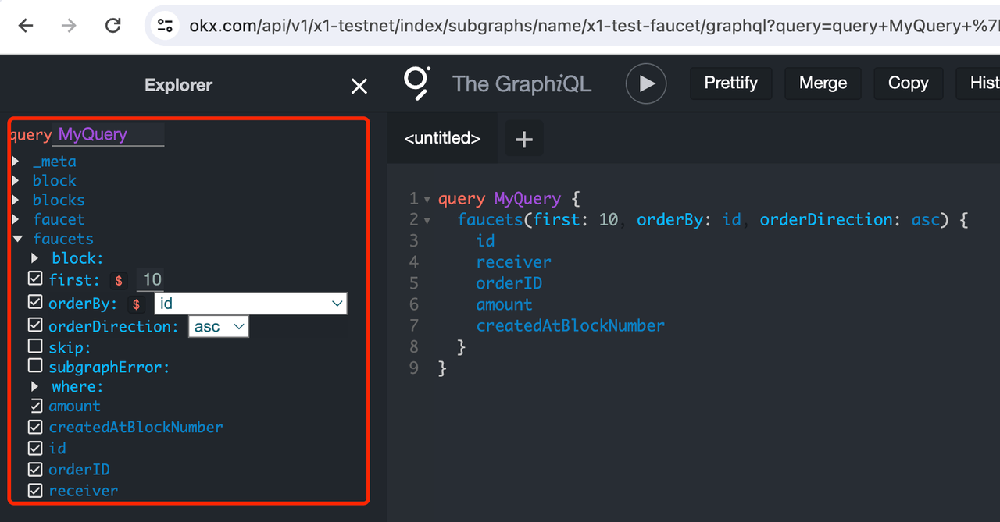
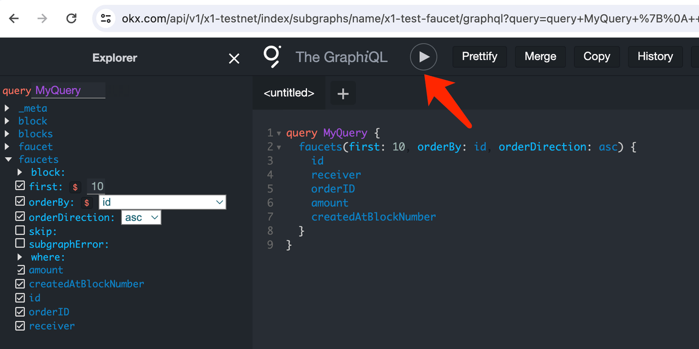

# Deploying subgraph
## Requirements
- "@graphprotocol/graph-cli": "^0.20.1"
- "@graphprotocol/graph-ts": "^0.20.1"
- "npm": "^7.20.5"

## Deployment steps
### 1. Upload Subgraph code to GitHub
- If the code repository is private, you must add your X1 Github account subgraph@okx.com. (This step is not necessary for public code repositories)
- Before uploading the subgraph code, please ensure that it has been compiled

### 2. Deploy the Subgraph on the hosted service
X1 team will help you with the deployment.

**Deployment suggestions
- Set startBlock to the block in which the smart contract of the data source was created
- Avoid excessive use of data sources to prevent resource consumption.
- Example：https://www.okx.com/api/v1/x1-testnet/index/subgraphs/name/x1-test-faucet/graphql

## Querying the Graph
After deploying the subgraph, it takes some time to synchronize the block height before querying becomes possible:
- Query URL ：`https://www.okx.com/api/v1/x1-testnet/subgraph/name/{Subgraph_name}`
- Query Playground：`https://www.okx.com/api/v1/x1-testnet/subgraph/name/{Subgraph_name}/graphql`

Please replace `{Subgraph_name}` in the example with your own Subgraph name.

## Specification definition of GraphQL language
```graphql
query [operationName]([variableName]: [variableType]) {
  [queryName]([argumentName]: [variableName]) {
    # "{ ... }" express a Selection-Set, we are querying fields from `queryName`.
    [field]
    [field]
  }
}
```

While the list of syntactic do's and don'ts is long, here are the essential rules to keep in mind when it comes to writing GraphQL queries:
- Each `queryName` must only be used once per operation.
- Each `field` must be used only once in a selection (we cannot query `id` twice under `token`)
- Some `field`s or queries (like `tokens`) return complex types that require a selection of sub-fields. Not providing a selection when expected (or providing one when not expected - for example, on `id`) will raise an error. 
- Any variable assigned to an argument must match its type.
- In a given list of variables, each of them must be unique.
- All defined variables must be used.

Failing to follow the above rules will end with an error from the Graph API.

## The anatomy of a GraphQL query
Unlike REST API, a GraphQL API is built upon a Schema that defines which queries can be performed.
For example, a query to get a block using the `GetBlocks` query will look as follows:
```graphql
query GetBlocks($id: ID!) {
  blocks(id: $id) {
    id
    number
    timestamp
  }
}
```
It will return the following predictable JSON response (when passing the correct `$id` variable value):
```json
{
    "data": {
        "blocks": [
            {
                "id": "...",
                "number": "...",
                "timestamp": "..."
            }
        ]
    }
}
```

## GraphQL API
- When querying a collection, the `orderBy` parameter can be used to sort by specific properties. `orderDirection` can be used to specify the sort.
- When querying a collection, you can use the `first` parameter to page from the beginning of the collection. The `skip` parameter can be used to skip entities and pagination.
- When querying a collection, you can use the `where` parameter to filter different properties.

**Example**
```graphql
query GetBlocks {
  blocks(
    first: 10
    orderBy: id
    orderDirection: desc
    skip: 10
    where: {number_gt: "7"}
  ) {
    id
    number
    timestamp
  }
}
```
For more features (such as time-travel queries, fulltext search queries), please refer to [GraphQL API](https://thegraph.com/docs/querying/graphql-api/ "GraphQL API").

### Combine multiple queries
Your application may need to query data for multiple entities, and you can send multiple queries in the same GraphQL request as follows:
```graphql
query GetInfo {
  blocks(
    first: 10
    orderBy: id
    orderDirection: desc
    where: {id: "0xffffc9887a687234b1076e3ccfb19d58b19746795ae13a5eea19286d6fc34f0b"}
  ) {
    id
    number
    timestamp
  }
  faucet(first: 10, orderBy: id, orderDirection: asc) {
    id
    receiver
    amount
  }
}
```

## Graph Explorer
Using [Graph Explorer](https://thegraph.com/explorer "Graph Explorer") will help you query data more easily. Take [x1-faucet-subgraph](https://www.okx.com/api/v1/x1-testnet/index/subgraphs/name/x1-test-faucet/graphql "x1-faucet-subgraph") as an example:
1. Click **Explorer** in the upper left corner to expand.



2. Select the query entity and filter.



3. Click this button to get results.



For more info about querying, visit [the Graph's Querying from an Application](https://thegraph.com/docs/querying/querying-from-an-application/ "the Graph's Querying from an Application").