# Bridge (mainnet)

## Bridging assets from Ethereum to X Layer mainnet

You can follow this step-by-step guide to learn how to bridge assets from **Ethereum** to **X Layer** mainnet.
1. Enter the X Layer mainnet [bridge](https://www.okx.com/xlayer/bridge "mainnet bridge") page, then select Ethereum (left) and X Layer (right) as the two bridging directions, as shown below:

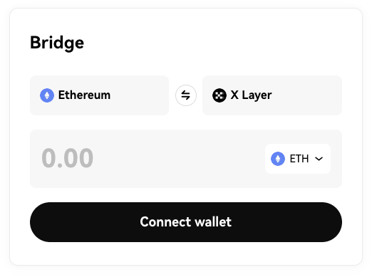

2. Click the **Connect wallet** button to connect your wallet:

3. Select the token you need to bridge (ETH is used as an example here), enter the amount, then click the bridge button:

<Tip title="Note" >
Please note that you need to reserve some ETH for Ethereum network fee.
</Tip>

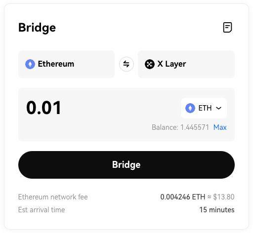

4. Check the bridge transaction details, then click the **Confirm** button:

5. Double check the transaction again in your wallet. Please wait for your transaction to be processed:

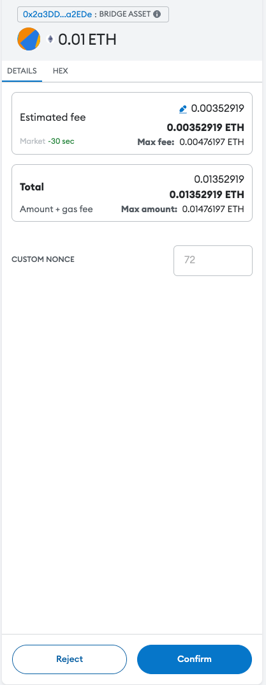

6. Your pending transactions will now appear at the bottom of your screen. You can also click the **View all transactions** button to view all of the bridge transactions you have made thus far:

<Tip title="Note" >
For security purposes, transactions need to await final confirmation on Ethereum for two epochs (64 confirmations), about 15 minutes.
</Tip>

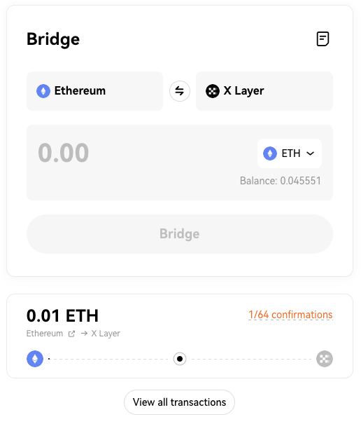

## Bridging assets from X Layer mainnet to Ethereum

You can follow this step-by-step guide to learn how to bridge assets from X Layer to Ethereum.

1. Enter the X Layer mainnet [bridge](https://www.okx.com/xlayer/bridge "mainnet bridge") page, then select X Layer (left) and Ethereum (right) as the two bridging directions, as shown below:

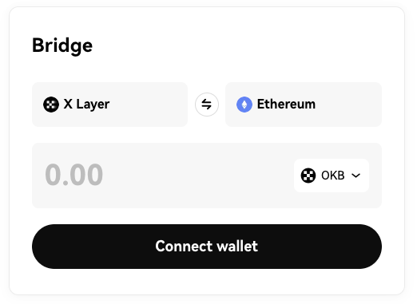

2. Click the Connect wallet button, and switch to X Layer (if you have not added X Layer yet, please add it first):

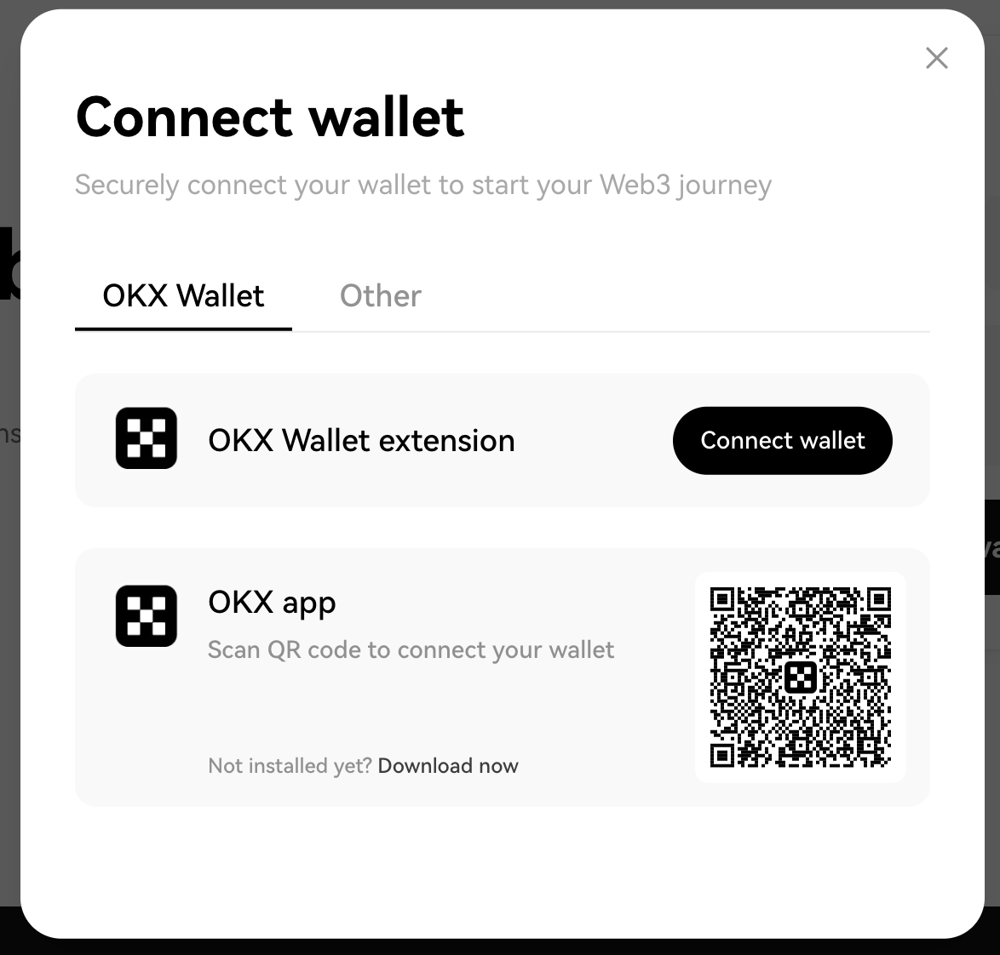

3. Select the token you need to bridge (OKB is used as an example here), enter the amount, then click the **Bridge** button:

<Tip title="Note" >
Please note that you need to reserve some OKB for X Layer network fee.
</Tip>

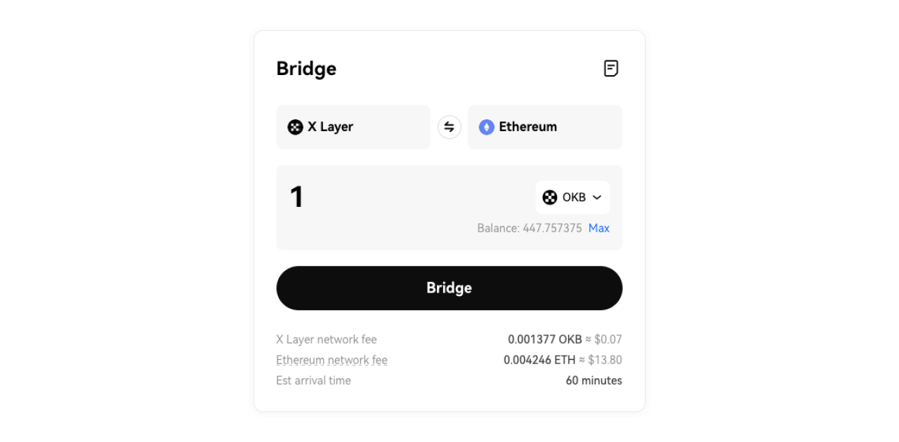

4. Check the bridge transaction details, then click the **Confirm** button:

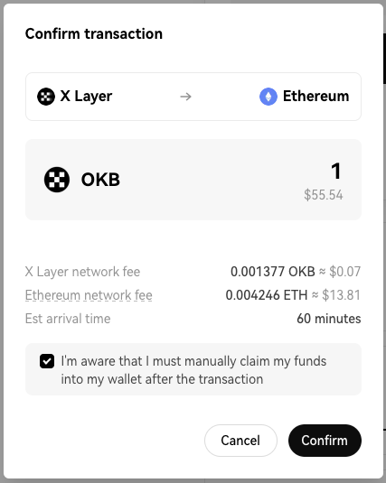

5. Double check the transaction again in your wallet. Please wait for your transaction to be processed:

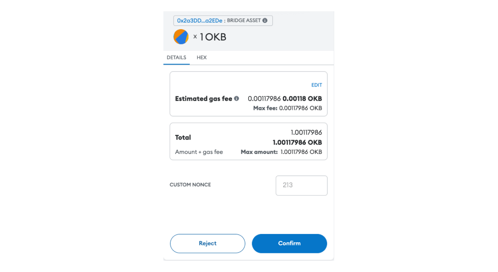

6. Your pending transactions will now appear towards the bottom of your screen. You can also click the **View all transactions** button to view all of the bridge transactions you have made thus far:

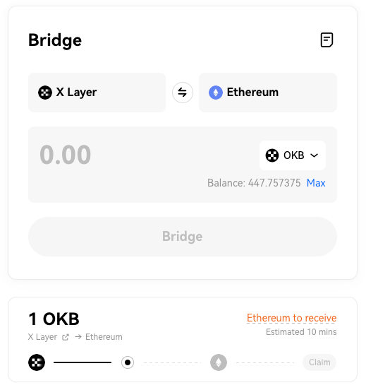

7. Click the **Claim** button (bottom right), and switch your wallet to the Ethereum network. Confirm the transaction in your wallet, then wait for your funds to arrive:

## FAQ

### How to clear your account activity/reset account in MetaMask？
How to clear your account activity/reset account in MetaMask？
You should only clear your account activity when strictly necessary, most often to resolve stuck and pending transactions. 

This function is intended primarily for developers, who may find it useful to clear an account's activity on a test network while continuing to use the same account. 

Note that clearing account activity only affects the current network. For example: if you're on X Layer testnet, the only activity that will be cleared are your transactions on X Layer testnet. Transactions on other networks, such as Ethereum, will be unaffected.

<Tip title="Note" >
**Clearing your activity is irreversible, and not a common requirement for most users. You will not lose value in your accounts.** 
</Tip>

To reset the account:

1. Click the three vertical dots in the top-right corner, and then go to **Settings > Advanced**.

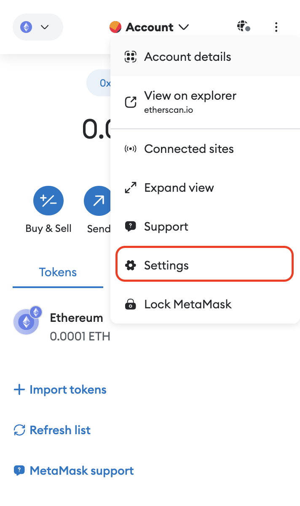

2. Scroll down to the '**Clear activity and nonce data**' section and click the button.

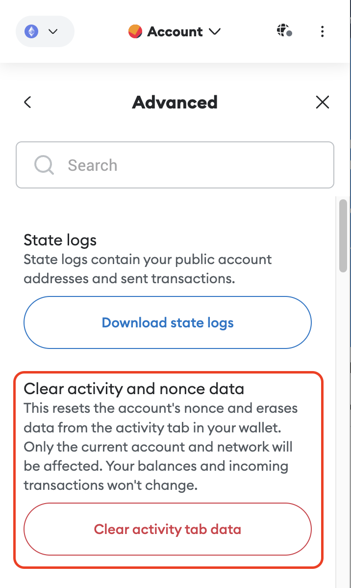

### How to reset the account in OKX wallet？

You should only reset your account activity when strictly necessary, most often to resolve stuck and pending transactions.

This function is intended primarily for developers, who may find it useful to clear an account's activity on a test network while continuing to use the same account. 

Note that resetting your wallet means restoring your OKX wallet to its initial state, and wiping out all the seed phrases, private keys, and wallet data. Once the reset is complete, you need to reimport your existing wallet in order to continue using it.

<Tip title="Note" >
Before resetting your account, you need to back up your wallet, or you will lose value in your accounts. For specific operations, please refer to this [document](https://www.okx.com/help/how-do-i-manage-my-wallet-web "manage wallet doc").
</Tip>

To reset the account:

1. Click the button in the top-right corner, and then go to **Settings > Wallet security**.

2. Click the **Reset** wallet button.

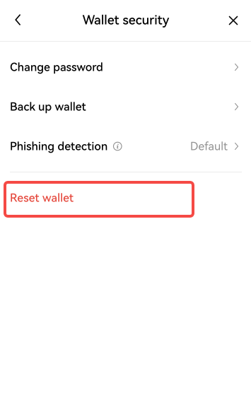

## Resources

### X Layer mainnet RPC

|Network name|X Layer|
|:----|:----|
|Native token|OKB|
|ChainID|196|
|RPC URL|https://rpc.xlayer.tech|
|Explorer|https://www.oklink.com/xlayer|

### Token information

|Network name|Name|X Layer mainnet address|
|:----|:----|:----|
|OKB|OKB|Native token|
|[WOKB](https://www.okx.com/explorer/xlayer/address/0xe538905cf8410324e03a5a23c1c177a474d59b2b "WOKB")|Wrapped OKB|[0xe538905cf8410324e03a5a23c1c177a474d59b2](https://www.okx.com/explorer/xlayer/address/0xe538905cf8410324e03a5a23c1c177a474d59b2b "0xe538905cf8410324e03a5a23c1c177a474d59b2b")|
|[WETH](https://www.okx.com/explorer/xlayer/token/0x5a77f1443d16ee5761d310e38b62f77f726bc71c "WETH")|Ethereum (Wrapped Ethereum)|[0x5a77f1443d16ee5761d310e38b62f77f726bc71c](https://www.okx.com/explorer/xlayer/address/0x5a77f1443d16ee5761d310e38b62f77f726bc71c "0x5a77f1443d16ee5761d310e38b62f77f726bc71c")|
|[USDT](https://www.okx.com/explorer/xlayer/address/0x1e4a5963abfd975d8c9021ce480b42188849d41d "USDT")|Tether USD|[0x1e4a5963abfd975d8c9021ce480b42188849d41d](https://www.okx.com/explorer/xlayer/address/0x1e4a5963abfd975d8c9021ce480b42188849d41d "0x1e4a5963abfd975d8c9021ce480b42188849d41d")|
|[USDC](https://www.okx.com/explorer/xlayer/address/0x74b7f16337b8972027f6196a17a631ac6de26d22 "USDC")|USDC|[0x74b7F16337b8972027F6196A17a631aC6dE26d22](https://www.okx.com/explorer/xlayer/address/0x74b7f16337b8972027f6196a17a631ac6de26d22 "0x74b7F16337b8972027F6196A17a631aC6dE26d22")|
|[WBTC](https://www.okx.com/explorer/xlayer/address/0xea034fb02eb1808c2cc3adbc15f447b93cbe08e1 "WBTC")|Wrapped Bitcoin|[0xEA034fb02eB1808C2cc3adbC15f447B93CbE08e1](https://www.okx.com/explorer/xlayer/address/0xea034fb02eb1808c2cc3adbc15f447b93cbe08e1 "0xEA034fb02eB1808C2cc3adbC15f447B93CbE08e1")|
|[DAI](https://www.okx.com/explorer/xlayer/address/0xc5015b9d9161dca7e18e32f6f25c4ad850731fd4 "DAI")|DAI|[0xC5015b9d9161Dca7e18e32f6f25C4aD850731Fd4](https://www.okx.com/explorer/xlayer/address/0xc5015b9d9161dca7e18e32f6f25c4ad850731fd4)