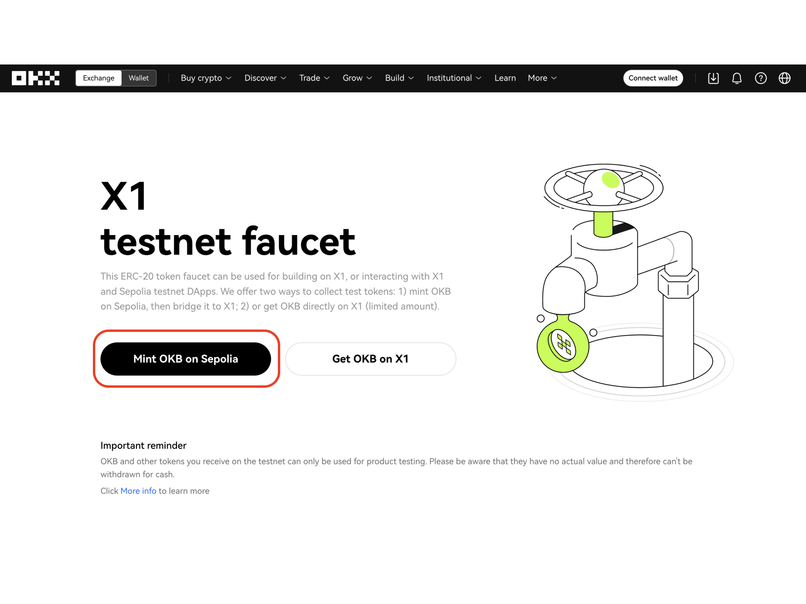
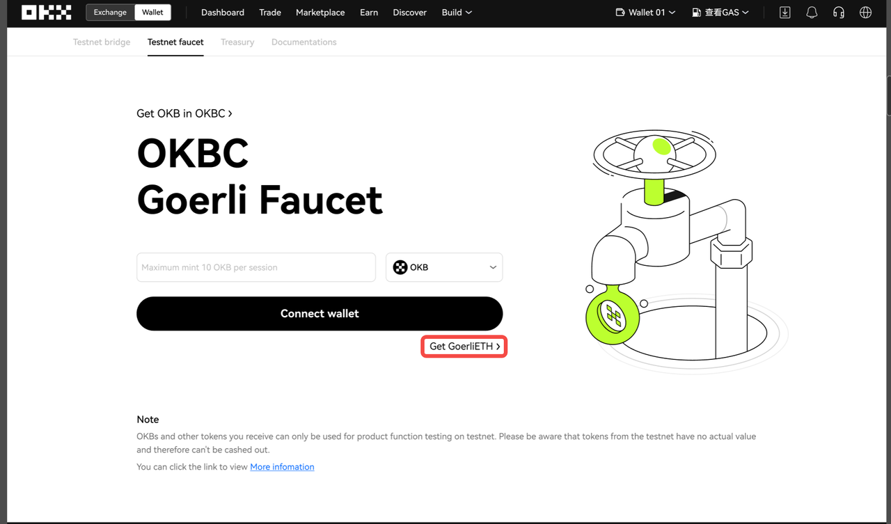
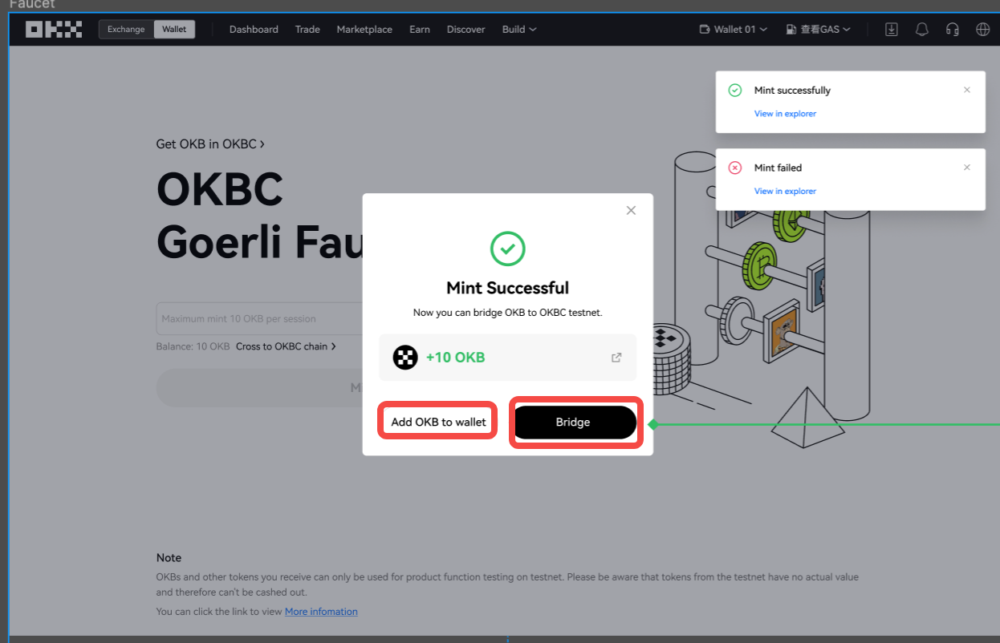

# Bridge testnet OKB from Sepolia to Xgon
**[Xgon faucet](http://www.okx.com/xgon/faucet "Xgon faucet")** is the official tool provided by the Xgon team for developers to claim test tokens. Developers can use Xgon faucet to obtain **testnet OKB  tokens** and other ERC-20 tokens.
Users can mint a certain amount of testnet OKB on the Sepolia testnet and then use our official Xgon bridge to bridge OKB (or other test tokens) from Sepolia to the Xgon testnet. 

<Tip title="Note">Please ensure that your wallet contains enough ETH (Sepolia ETH) for gas fees on the Sepolia network. You can also use the Xgon bridge to bridge ETH to the Xgon testnet.</Tip>

## How to claim ETH
You can obtain ETH from the following third-party faucets, each with its own claiming requirements. Choose the one that suits your needs:
- [Quick Node](https://faucet.quicknode.com/ethereum/sepolia)
- [Alchemy](https://sepoliafaucet.com/)
If you have already claimed ETH, you can switch your wallet network to the Sepolia network and check if the ETH has been credited. If you are using the OKX Wallet, you need to enable **Settings - Custom network** and select the Sepolia network.

## Xgon Sepolia faucet
1. Navigate to the Xgon faucet official website and click the Get OKB on Sepolia button to proceed.

2. Connect your wallet plugin and switch your wallet network to Sepolia. If you have insufficient ETH, you can click the Get Sepolia ETH button to obtain ETH from a third-party faucet.

3. Select the token you want to receive and enter the quantity. Then, click the Mint button at the bottom. 

The maximum quantity per mint currently is 10 OKB.
4. Finally, confirm this transaction in your wallet plugin. After the transaction is successful, a success message popup will appear. You can add the minted OKB to your wallet (if not added previously) or click Bridge to cross-chain the OKB to the Xgon testnet.

### Token addresses
|Tokens|Sepolia testnet token addresses|Xgon testnet token address|
|:----|:----|:----|
|USDC|0xcd322438f77D40de3E0C5C3e6De273CE62fee00d|TBC|
|USDT|0x83DEEA85Cb705A486E546f980eC1D620652Dd9FC|TBC|
|DAI|0x36058F504beB8D1512850944fFf80a108F87574F|TBC|
|BTC|0x81BbF1F929d743CB188FBD268480168680782b3b|TBC|
|OKB|0x783D0E3583377432e4fC9af442dEDfF9D93bD715|TBC|