# Bridge
## Bridging assets from Sepolia to X1 testnet
You can follow this step-by-step guide to learn how to bridge assets from Ethereum Sepolia testnet to X1 testnet.
1. Enter the [X1 bridge testnet page](https://www.okx.com/x1/bridge-test "X1 bridge testnet page"), then select **Sepolia** (left) and **X1 testnet** (right) as the two bridging directions, as shown below:

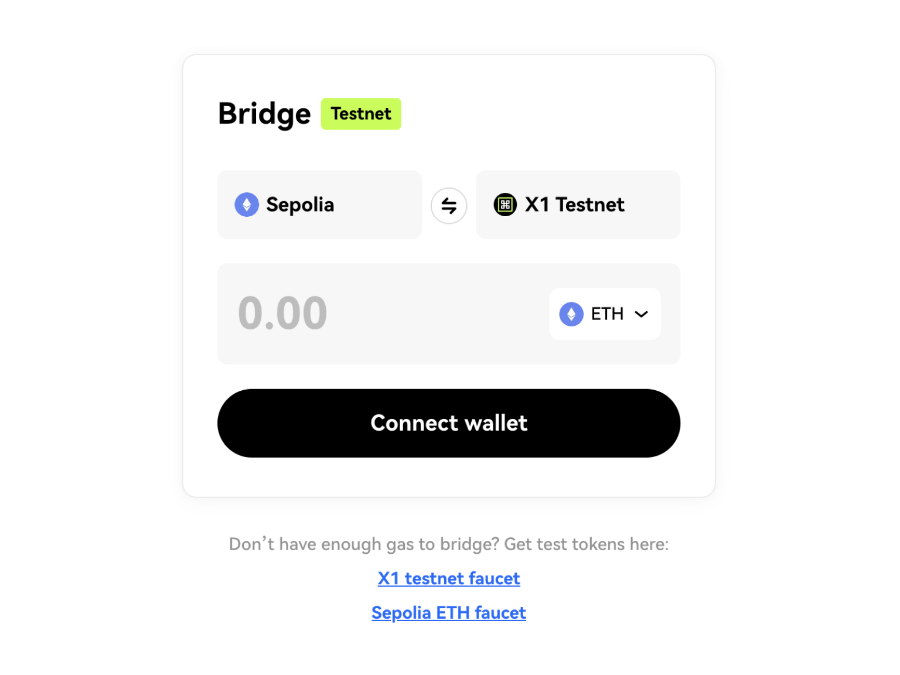

2. Click the Connect wallet button to connect your wallet:

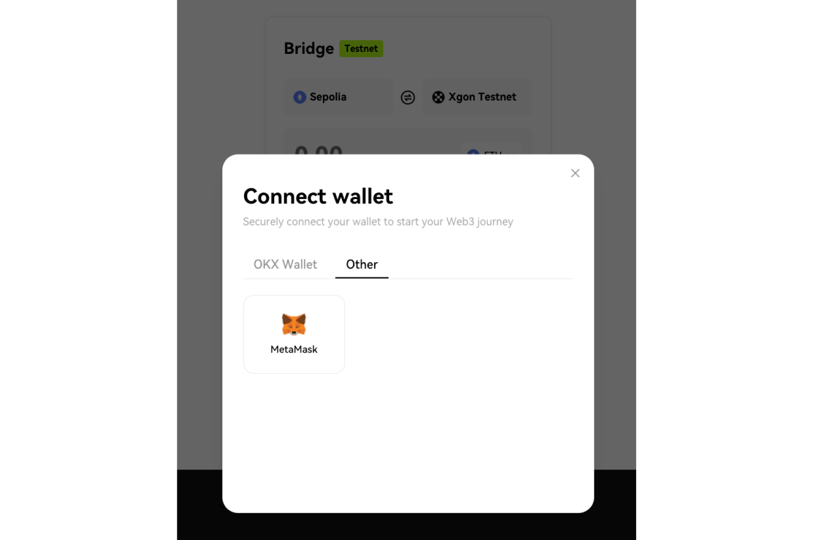

3. Select the token you need to bridge (ETH is used as an example here), enter the amount, then click the **Bridge** button:

<Tip title="Note">Please note that you need to reserve some ETH for Sepolia network fee.</Tip>

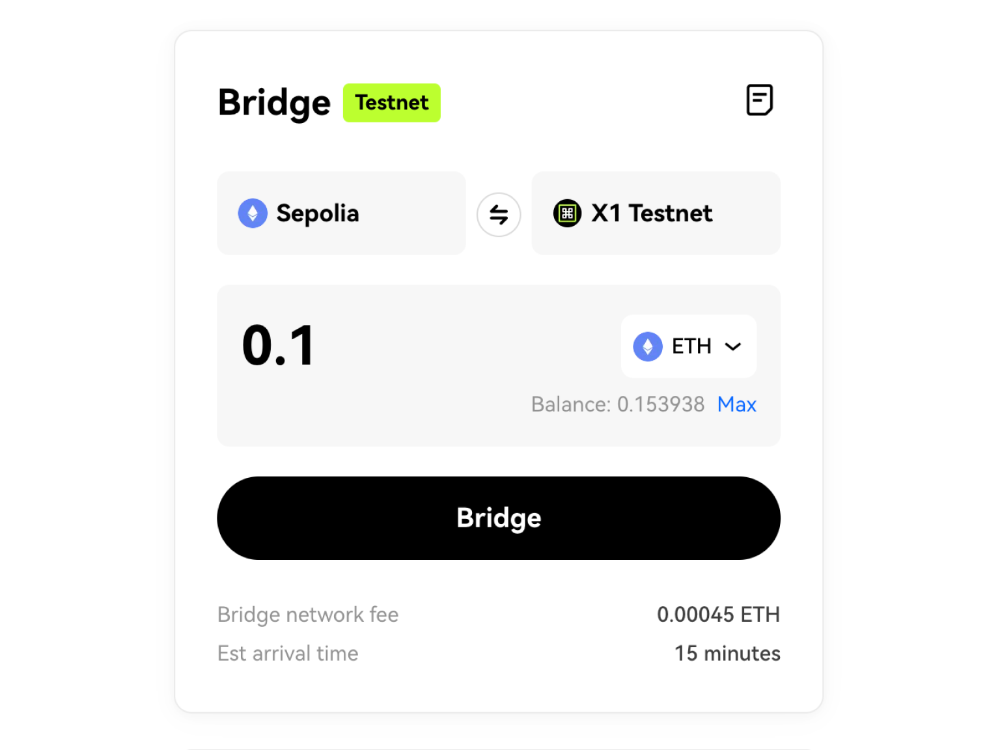

4. Check the bridge transaction details, then click the **Confirm** button:

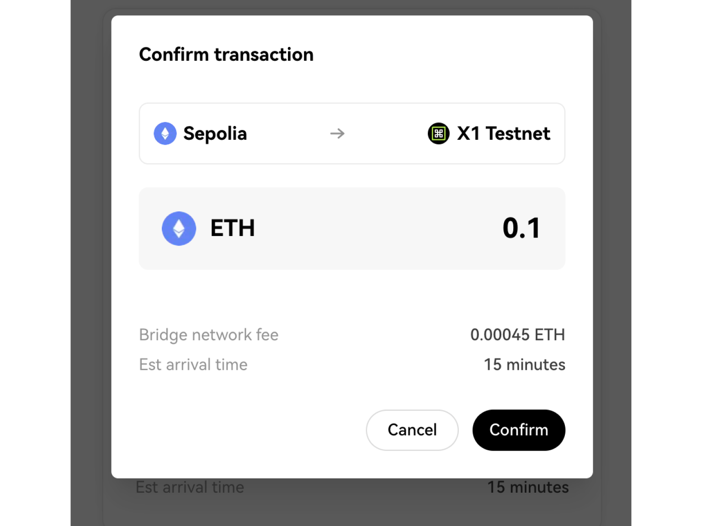

5. Double check the transaction again in your wallet. Please wait a few moments for your transaction to be processed:

6. Your pending transactions will now appear towards the bottom of your screen. You can also click the **View all transactions** button to view all of the bridge transactions you have made thus far:

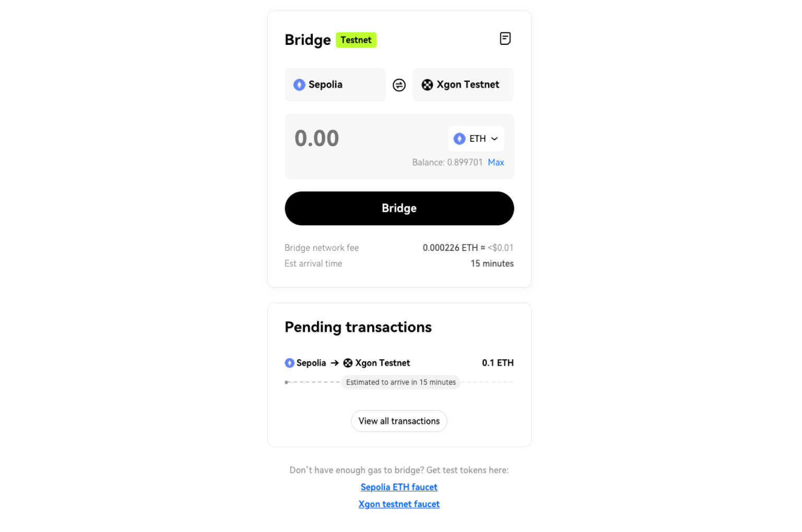

## Bridging assets from X1 testnet to Sepolia
You can follow this step-by-step guide to learn how to bridge assets from X1 testnet to Ethereum Sepolia testnet.
1. Enter the X1 bridge testnet(URL 待补充) page, then select **X1 testnet*** (left) and **Sepolia** (right) as the two bridging directions, as shown below:

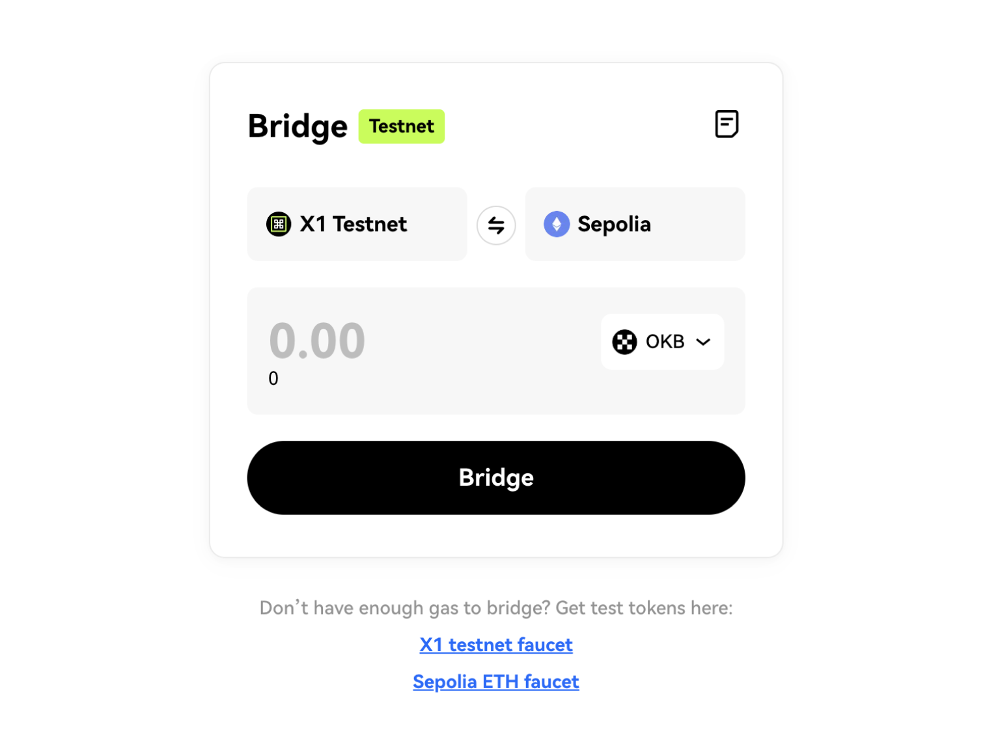

2. Click the **Connect wallet** button, and switch to X1 testnet (if you have not added X1 testnet yet, please add it first):

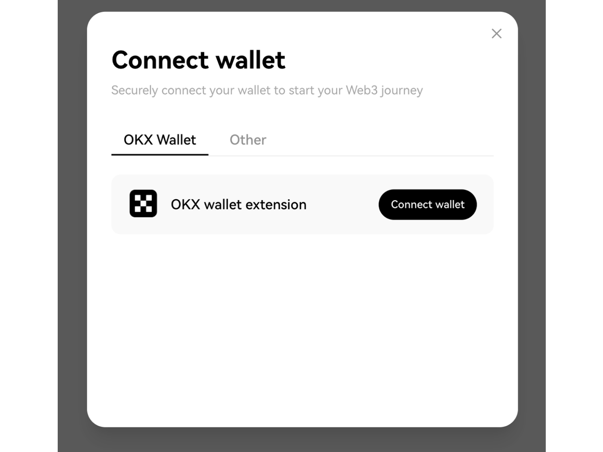

3. Select the token you need to bridge (OKB is used as an example here), enter the amount, then click the **Bridge** button:

<Tip title="Note">Please note that you need to reserve some OKB for X1 testnet network fee.</Tip>

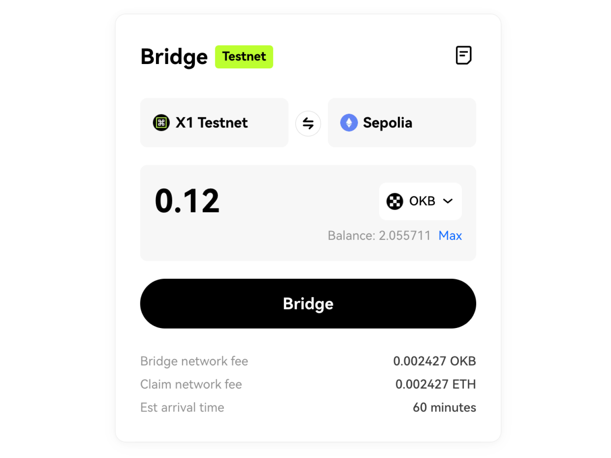

4. Check the bridge transaction details, then click the **Confirm** button:

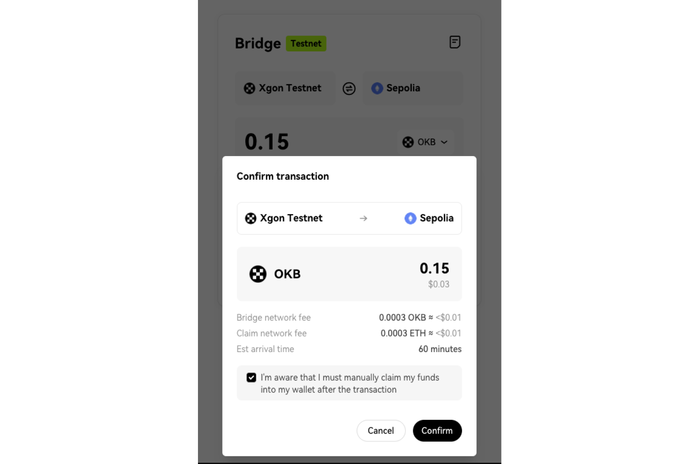

5. Double check the transaction again in your wallet. Please wait a few moments for your transaction to be processed:

6. Your pending transactions will now appear towards the bottom of your screen. You can also click the **View all transactions** button to view all of the bridge transactions you have made thus far:

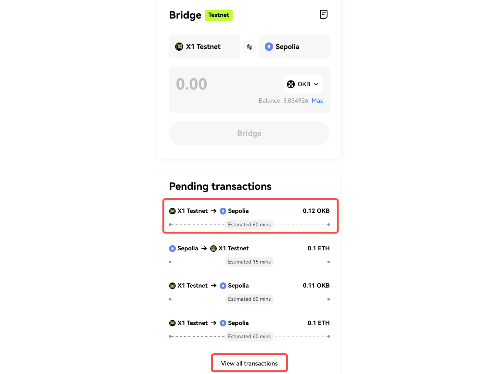

7. Click the **Claim** button (bottom right), and switch your wallet to the Sepolia network. Confirm the transaction in your wallet, then wait for your funds to arrive:

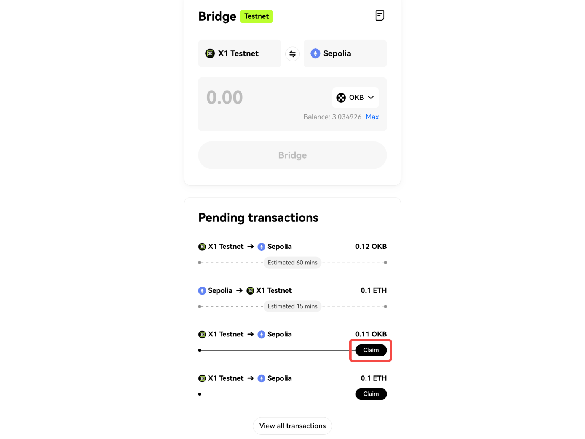

## Resources
### L1 and L2 tokens

### Ethereum Sepolia testnet info
|Network name|Sepolia|
|:----|:----|
|RPC|https://eth-sepolia.g.alchemy.com/v2/[YOUR-API-KEY]|
|Chain ID|11155111|
|Symbol|SepoliaETH|
|Explorer|https://sepolia.etherscan.io/|

### X1 testnet info
|Properties|Network details|
|:----|:----|
|Network name|X1 testnet|
|RPC URL|https://testrpc.x1.tech|
|Chain ID|195|
|Token symbol|OKB|
|Block explorer URL|https://www.oklink.com/x1-test|

## Faucet links
* **Sepolia ETH faucet**：https://sepoliafaucet.com/
* **X1 testnet faucet**：http://www.okx.com/x1/faucet
