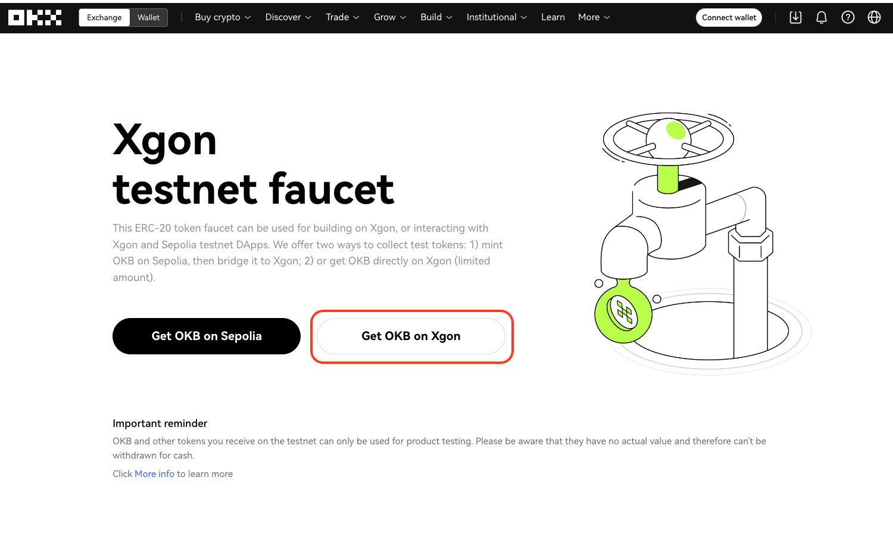
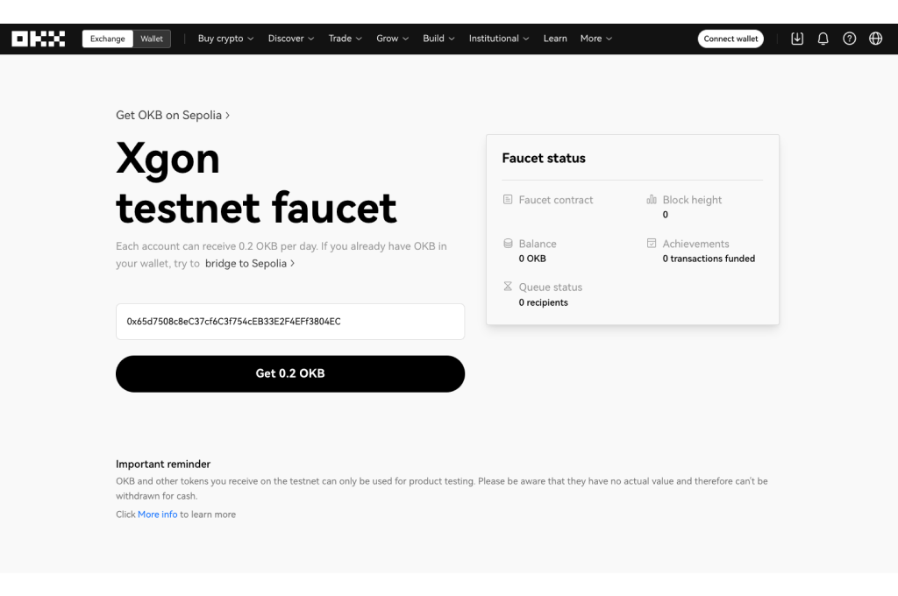
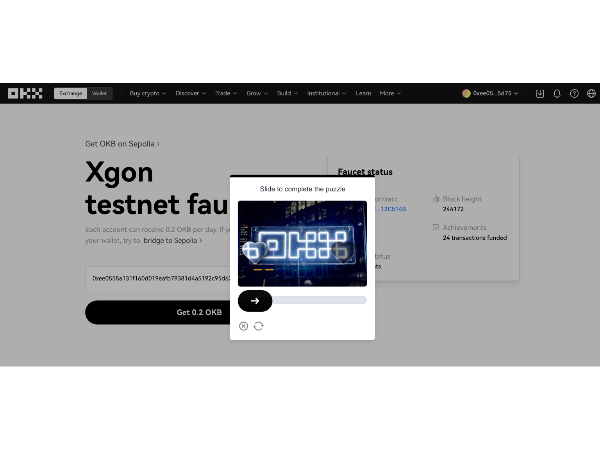
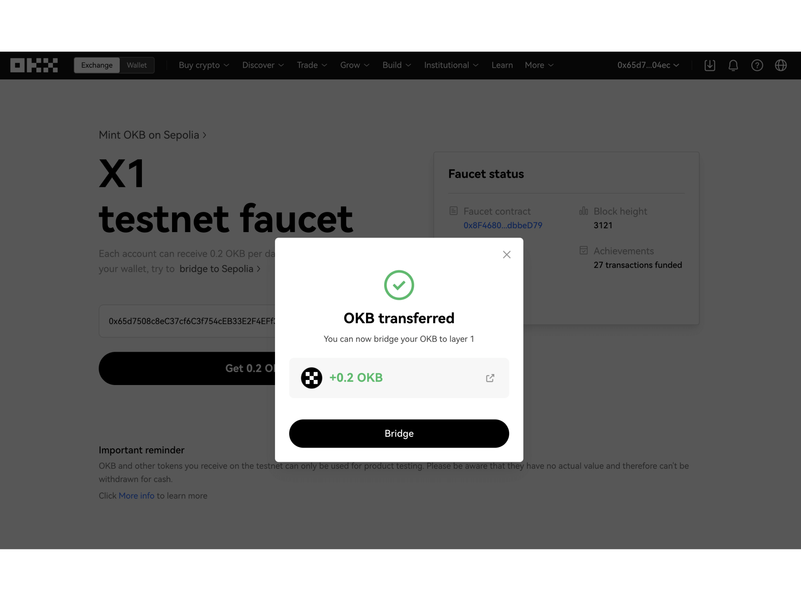

# Get testnet OKB from faucet
Despite bridging OKB from Sepolia to XGON testnet, you can directly input your wallet address on the [XGON faucet](http://www.okx.com/xgon/faucet "XGON faucet") and claim a small fixed amount of OKB.

<Tip title="Note">Please note that on the XGON testnet, each user can only claim **0.2 OKB per day**.</Tip>

## How to claim OKB
1. Go to the XGON faucet official website and click the **Get OKB in XGON** button to proceed.

2. Input your wallet address in the field. If you have connected a wallet plugin (EVM network), the field will automatically display your current wallet address. Then, click the **Get 0.2 OKB** button at the bottom.

3. You will need to complete a slider verification to prove that you are not a robot.

4. Once the slider verification is done, your request will be queued. A popup will appear if you have successfully claimed **OKB**. You can also click the **Bridge** button to bridge OKB to Sepolia.

