# Set up wallets
## What is a wallet?
A crypto wallet serves as a tool for storing, transferring, and engaging with blockchain networks. These wallets come in three primary types: software, hardware, and paper wallets. Depending on their connectivity to the internet, wallets can also be categorized as either "hot" or "cold."

A crypto wallet is composed of pairs of public and private keys. These keys are utilized for signing, sending, receiving transactions, and monitoring asset ownership. The wallet generates a public key from the private key, resulting in a public address represented by alphanumeric characters. This address is used to receive cryptocurrency assets and can be shared with others. However, **the private key must remain confidential** to prevent asset loss.
Before interacting with the X1, it is essential to create a plugin wallet. We recommend using the following two wallets:

## Supported wallets
List of wallets supporting X1:

|Wallets|Custody|Website link|Platform|Network|
|----|----|----|----|----|
|OKX Wallet|Non-custodial|https://www.okx.com/web3|Mobile, browser|Multi-chain|
|MetaMask|Non-custodial|https://metamask.io|Mobile, browser|EVM|
|Particle Network|Non-custodial|https://particle.network|Mobile, browser, embedded|Multi-chain|
|imToken|Non-custodial|https://token.im|Mobile, browser, hardware wallet|Multi-chain|

## How to configure network information
After creating a wallet, you may need to manually configure the network information for the X1 testnet within your plugin wallet. Here are the relevant details:
|Properties|Network details|
|:----|:----|
|Network name|X1 testnet|
|RPC URL|https://testrpc.x1.tech|
|Chain ID|195|
|Token symbol|OKB|
|Block explorer URL|https://www.oklink.com/x1-test|

### Adding network via Chainlist (recommended)
1. Navigate to [Chainlist](https://chainlist.org/chain/195).
2. Click **Connect Wallet** button if not connected yet.

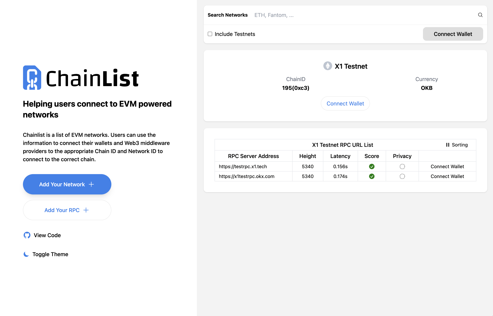

3. If you have connected  wallet, try to click the **Add to Metamask** button.

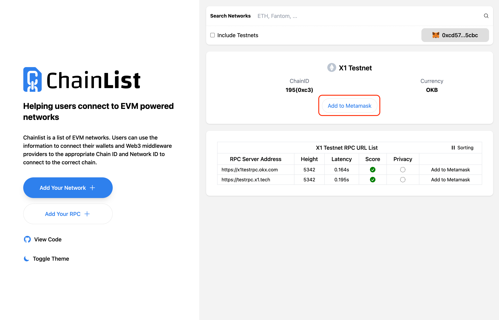

4. In the popup of the plugin wallet, click the **Approve** button in the bottom right corner.

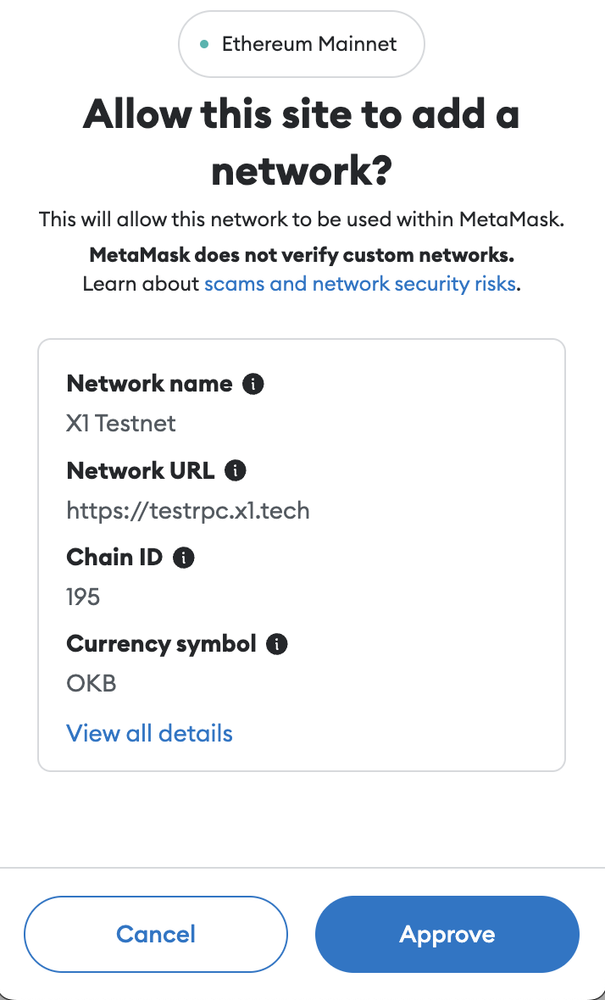

### Adding network in MetaMask
1. Unlock your MetaMask wallet and click the  **More** icon at the top right:

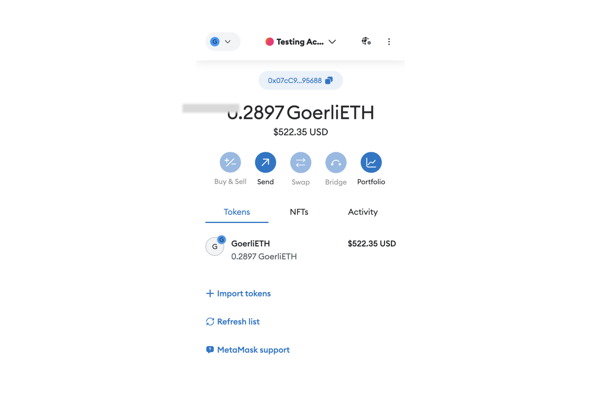

2. In the dropdown menu, click the **Settings** selection:

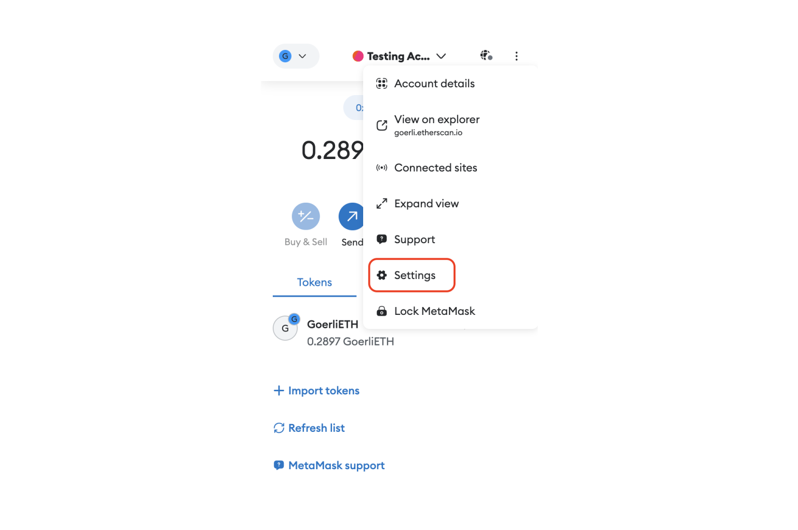

3. From the **Settings** list, select Networks to show the list of networks:

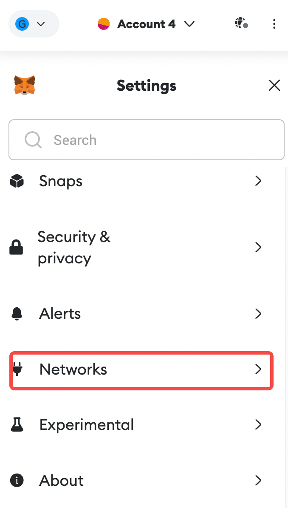

4. Click the **Add network** button at the bottom of the page:

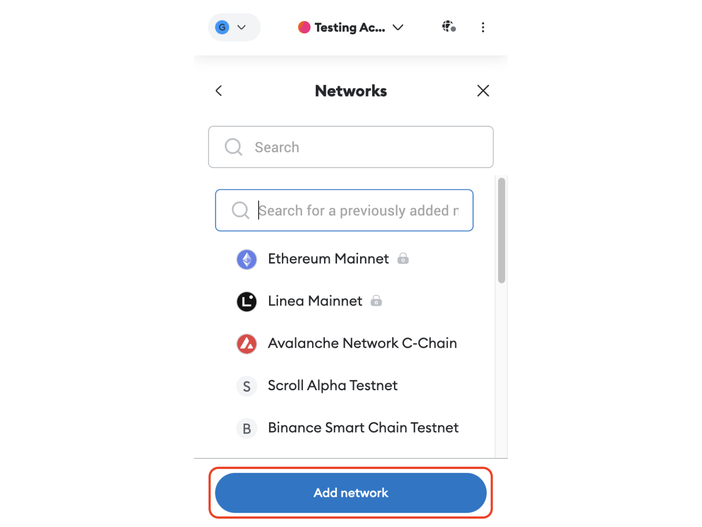

5. Click **Add a network manually** at the bottom:

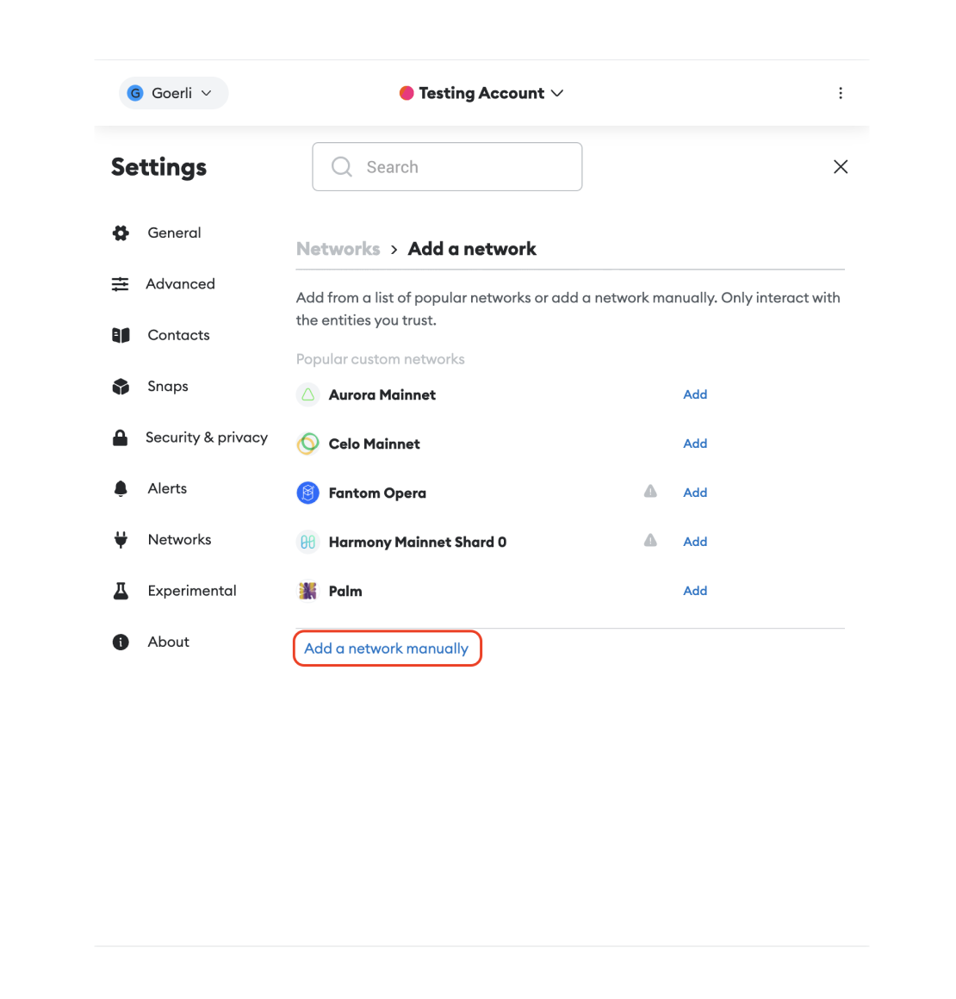

6. Populate the network information for the X1 testnet as described above and click the Save button:

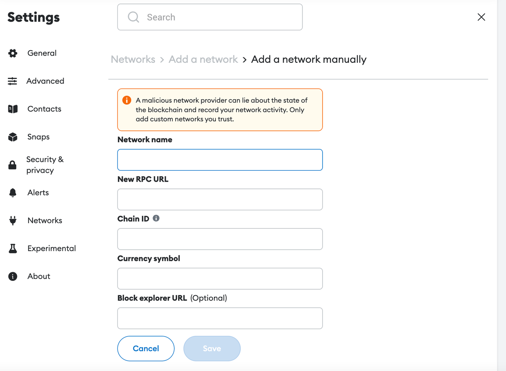

You can now view the successfully configured X1 testnet network within your wallet!

### Switching to X1 network in OKX Wallet
1. Unlock your OKX Wallet and click the network selection icon in the upper right corner, which is selected as All networks by default.

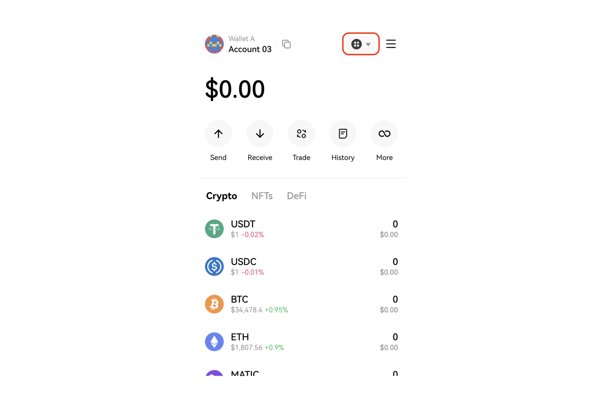

2. Click Testnet tap and find the X1 testnet. Click the bottom to switch to X1 testnet.

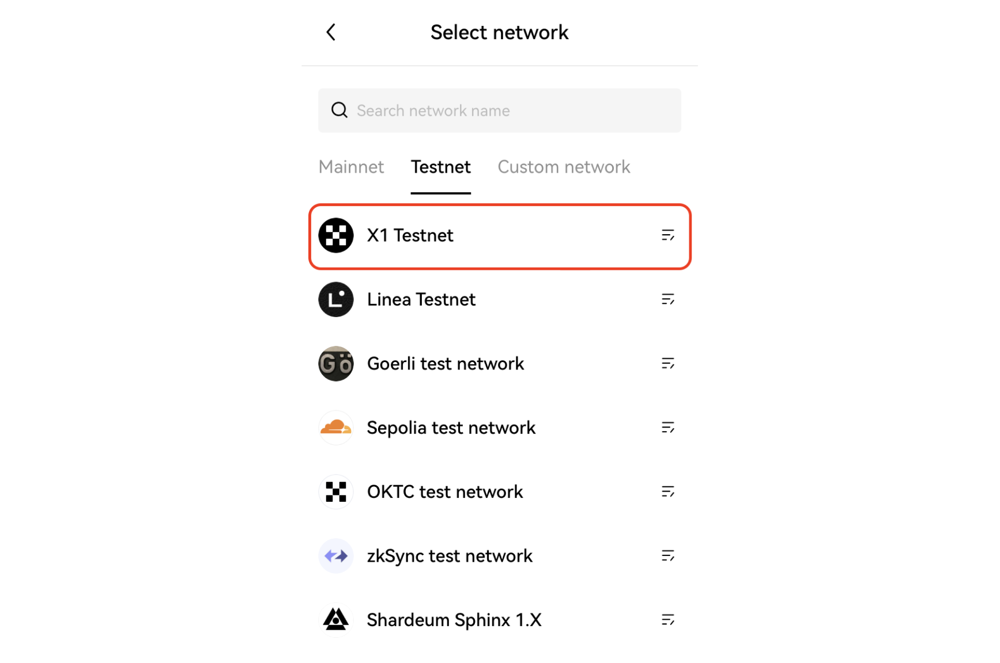

You are now on the X1 testnet. Head to the X1 faucet to claim test tokens and embark on your journey into the world of Web3!

### Switching to X1 network in Particle Wallet (Particle Network)
1. Log into Particle Wallet, either through the [web app](https://wallet.particle.network "web app") or [mobile app](https://apps.apple.com/us/app/particle-crypto-wallet/id1632425771 "mobile app"), and navigate to the network selection menu in the upper left corner.

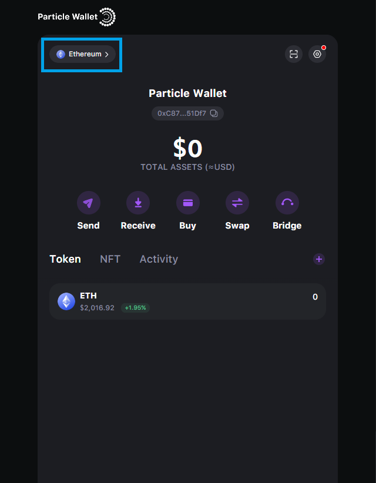

2. Enable **Test Network**, search for **X1 Testnet**, and click **X1 Testnet**.

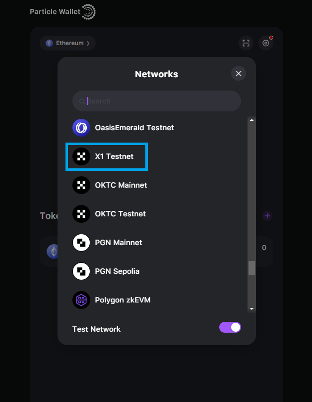

You're now connected to the X1 testnet on Particle!