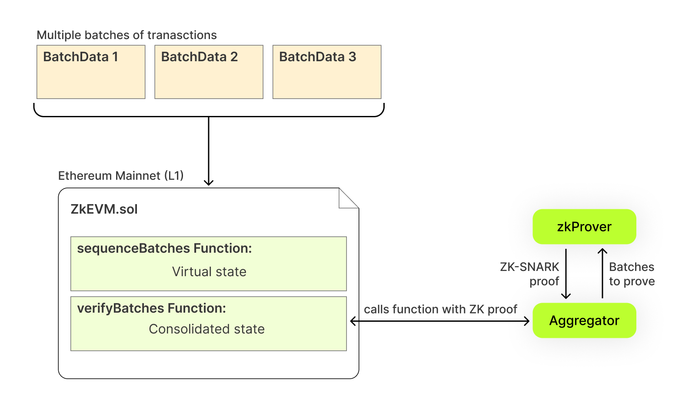
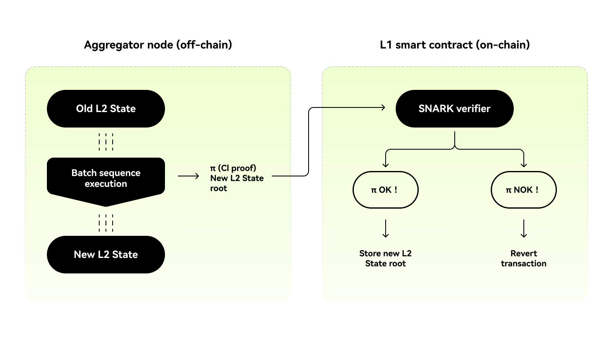

# Batch aggregation
## Aggregation summary
Upon reaching the layer 1 (L1) network, after all sequenced batches have been processed, the final step involves creating a zero-knowledge (zk) proof to validate the transactions' legitimacy. Aggregator nodes collect the sequenced batches and deliver them to the zkProver, which employs the fflonk protocol to produce a conclusive SNARK (Succinct Non-interactive Argument of Knowledge) proof. Subsequently, the aggregator receives a zk-proof that is compact enough to be stored on Ethereum's L1.

<Tip title="Note">SNARK, which stands for Succinct Non-interactive Arguments of Knowledge, serves as the underlying verification schema for Zero-Knowledge proofs. Its primary distinguishing features include its conciseness and rapid verification capabilities.</Tip>


Ultimately, the batches of transactions are consolidated into a final state, thereby inheriting Ethereum's security model. This is achieved by posting and proving all transaction data back on Ethereum's L1.

As depicted in the above diagram, the off-chain execution of batches implies a transition to a new layer 2 (L2) state, resulting in a change to a new L2 state root. An aggregator generates computational integrity (CI) proof of this execution, and its on-chain verification ensures the validity of the resulting L2 state root.

## Aggregating batches
Once the aggregator node possesses the proof, it invokes the `ZkEVM.sol` smart contract's `trustedVerifyBatches` function and provides the received proof. Here's the function's source code:
```
function trustedVerifyBatches (
  uint64 pendingStateNum,
  uint64 initNumBatch,
  uint64 finalNewBatch,
  bytes32 newLocalExitRoot,
  bytes32 newStateRoot,
  uint256 [2] calldata proofA,
  uint256 [2][2] calldata proofB,
  uint256 [2] calldata proofC
) public onlyTrustedAggregator
```
In the context of this function:
- `pendingStateNum` represents the number of pending state transitions to be consolidated, which is set to 0 as long as the trusted aggregator is operational. This `pending state` acts as a security measure for L2 state consolidation by an independent aggregator.
- `initNumBatch` is the index of the last batch in the previous aggregated sequence.
- `finalNewBatch` is the index of the last batch in the sequence being aggregated.
- `newLocalExitRoot`  is the root of the bridge's L2 exit Merkle tree at the end of sequence execution, which is used to compute the new global exit root during sequence aggregation, allowing bridge claiming transactions to be executed successfully on L1.
- `newStateRoot`  is the L2 state root resulting from the execution of the sequence of batches in an older L2 state.
- `proof(A,B and C)` are the components of the zk-proof.

To successfully aggregate a sequence of batches, the following conditions must be met:
- The aggregation transaction must be sent from the trusted aggregator account.
- `initNumBatch` must correspond to an already aggregated batch, meaning it must have an L2 state root in the "batchNumToStateRoot" mapping.
- `initNumBatch` must be less than or equal to the index of the last aggregated batch.
- The sequence to be aggregated must contain at least one batch.
- Both `initNumBatch` and `finalNewBatch` must be batches that are part of the `sequencedBatches` mapping.
- Zk-proof of computational integrity must be successfully verified.

The executor and the prover are tools used by the aggregator to execute batches of transactions and generate zk-proofs. The interaction process is as follows:
1. Execute a sequence of transaction batches based on the current L2 state.
2. Calculate the resulting L2 state root.
3. Generate a zk-proof of computational integrity for execution.

The following code demonstrates how to verify the zk-proof on L1:
```
// Get snark bytes
bytes memory snarkHashBytes = getInputSnarkBytes (
  initNumBatch,
  finalNewBatch,
  newLocalExitRoot,
  oldStateRoot,
  newStateRoot
);

// Calculate the snark input
uint256 inputSnark = uint256(sha256(snarkHashBytes)) % _RFIELD;

// Verify proof
require (
  rollupVerifier.verifyProof(proofA, proofB, proofC, [inputSnark]),
  "ZkEVM :: _verifyBatches : Invalid proof"
);
```
Regarding the `inputSnark` section, please refer to the [**Transaction validation**](/technology/xgon-protocol/transaction-validation "Transaction validation") chapter for more details.