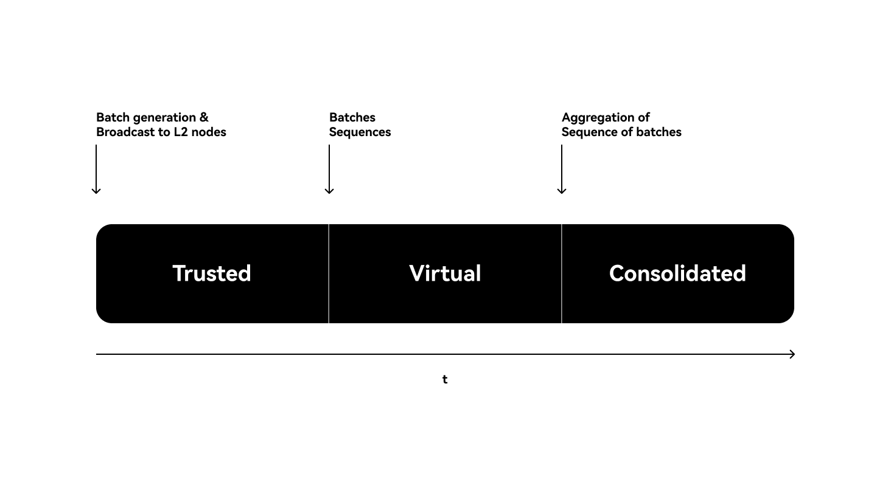
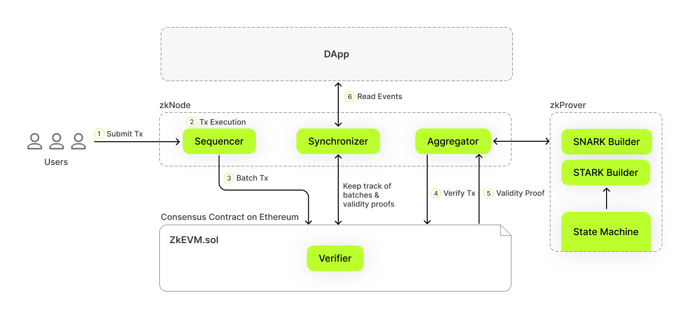

# Transaction stages
The process of validating a specific transaction within the batch typically involves three steps:
1. **Trusted state**: This state is given by the trusted sequencer almost instantaneously. The state is updated on L2, but has not yet reached L1.
2. **Virtual state**: Batches have been sequenced and data is on L1. At this point, transactions and data can not be modified as the state is final, yet they are not yet proven and are available on L1 for anyone to prove.
3. **Verified state**: Zk-proof has been posted on L1, and the smart contract verifies the virtual state, allowing for the withdrawal of funds.

## Data flow in Xgon
Transactions on the Xgon network have a typical flow starting from the users' interactions with their wallet on Xgon, to how the transactions are batched, sequenced, and aggregated on Ethereum L1:
1. Transactions are submitted to Xgon.
2. Transactions are executed almost instantly.
3. Transactions are batched together using data encryption methods.
4. Batches are sequenced and sent to Ethereum L1.
5. Consolidated finality is achieved on Ethereum L1 with the power of zk-proofs.

### 1. Submitting transactions
As a user, you submit transactions by signing transactions and sending them through the JSON-RPC interface.

### 2. Executing transactions
The transactions are then stored in the pending transaction pool, where the sequencer node running the zkEVM software picks these transactions up and decides which ones it wants to process or discard.
The sequencer will do a few of the following checks to see if the transaction should be discarded or processed:
1. If the sender has sufficient funds to complete the transaction
2. If the smart contract called actually exists and contains valid bytecode
3. If the transaction is not a duplicate
4. If the transaction does not involve a "double-spend", which means the sender's funds have not already been used in another transaction

Once the transaction is considered valid, the sequencer will update the Xgon state. Users will experience transactions going through almost instantly.
From here onwards, the user remains engaged in the Xgon L2 state. Everything that follows involves sharing transaction data back to Ethereum L1, but this step is only important for users who wish to transfer their funds from Xgon L2 back to Ethereum L1.

### 3. Batching transactions
The sequencer combines multiple transactions into a single batch and sends them to the `ZkEVM.sol` smart contract. This contract is stored on Ethereum mainnet and also has a separate version on the Ethereum Sepolia testnet.
Batches are not necessarily validated or confirmed at this stage.

### 4. Verifying transactions
Using ZKPs, the `ZkEVM.sol` smart contract acts as a verifier in verifying transactions. It verifies whether the batch just received is valid or not, through sending the batch to an aggregator node.

### 5. Generating & verifying zk-proofs/validity proofs
The `ZkEVM.sol` smart contract sends the batch it just received to an aggregator node, which is a machine running zkEVM software that communicates with a zkProver. The flow is as follows:
  - The aggregator receives the batch from the smart contract
  - The aggregator sends the batch to the zkProver
  - The zkProver creates multiple zk-STARKs -> a single zk-STARK -> a zk-SNARK
  - The zk-SNARK (the validity proof) gets sent back to the aggregator
  - The aggregator sends back the validity proof to the `ZkEVM.sol` smart contract
  - `ZkEVM.sol` verifies the validity proof
    - If the validity proof is valid, accept it
    - If it is not valid, reject it

### 6. Reading events on Xgon
Finally, DApps read information from Xgon through the synchronizer.
It reads events from the Ethereum smart contract(s), storing knowledge of both the zk-validity proofs from the aggregator, and the batches submitted from the sequencer.
This way, DApps can easily get a view of the state of Xgon via JSON-RPC.

<Tip title="Note">To find answers to more transaction-related questions, you can visit [Polygon's zkEVM protocol FAQ](https://wiki.polygon.technology/docs/zkevm/faq/zkevm-protocol-faq/ "Polygon's zkEVM protocol FAQ") for more info.</Tip>