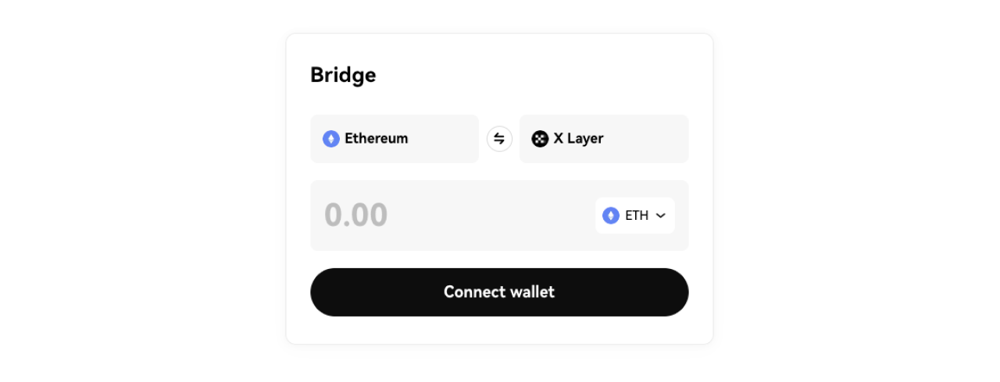
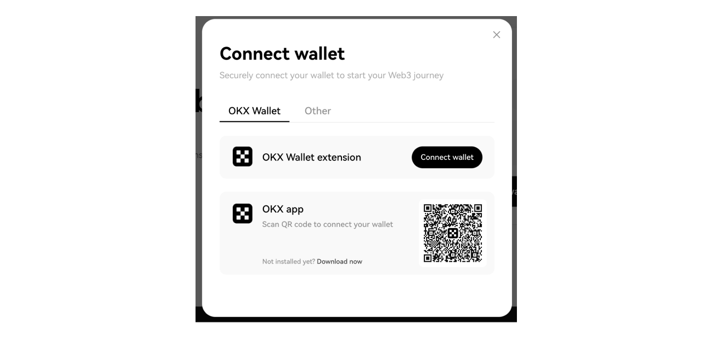
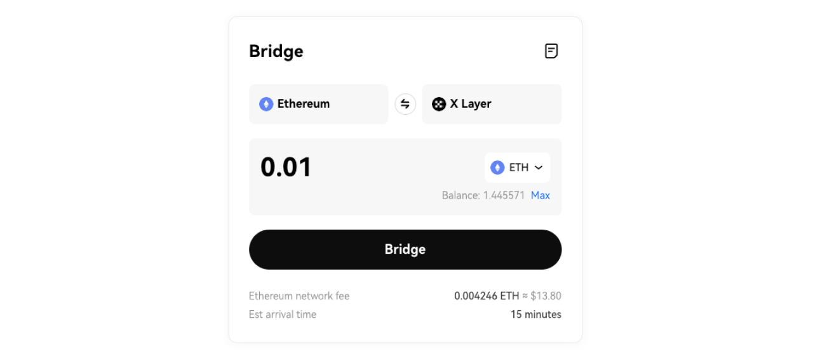
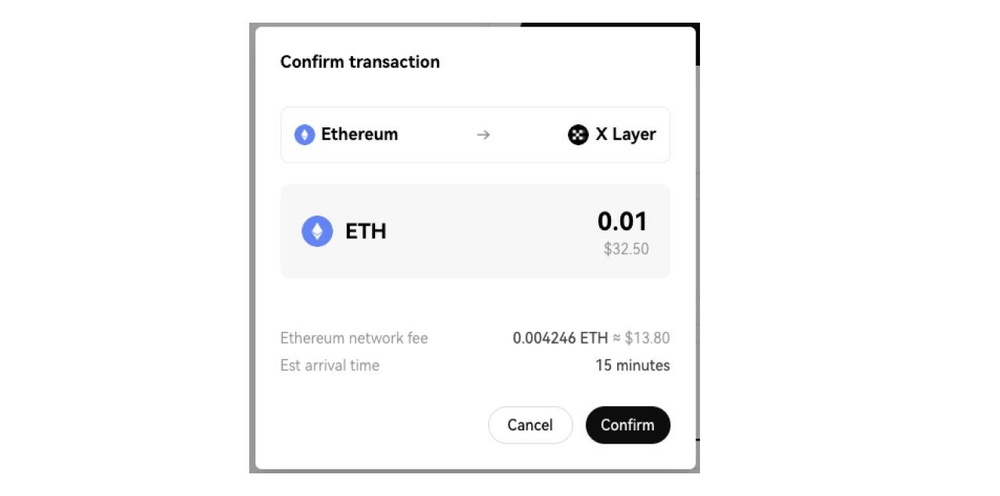
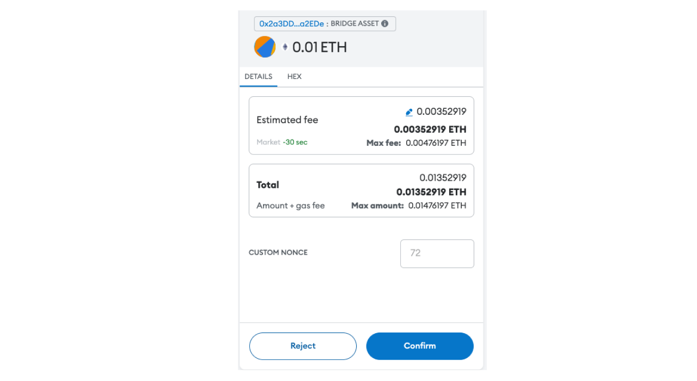

# Bridge funds to X Layer

You can bridge over existing assets from other networks to X Layer by using the following options:

1. [X Layer official bridge](https://www.okx.com/xlayer/bridge "official bridge")

2. [Third-party bridges](https://www.okx.com/xlayer/ecosystem "ecosystem bridges")

```<Tip title="Third-party bridges">
You can find third-party bridges on the [ecosystem portal](https://www.okx.com/xlayer/ecosystem "ecosystem portal"). Use the filter to find the available third-party bridges. Note that these are permissionless bridges, and, you should do your own research before interacting with dApps in order to keep your funds safe.
</Tip>
```


## Bridge assets from Ethereum to X Layer via official bridge

You can follow this step-by-step guide to bridge your assets from Ethereum to X Layer mainnet. You can also follow this same flow to bridge assets from X Layer mainnet to Ethereum.

1. Enter the X Layer mainnet [bridge](https://www.okx.com/xlayer/bridge "official bridge") page, then select Ethereum (left) and X Layer (right) as the two bridging directions, as shown below:



2. Click the "Connect wallet" button to connect your wallet:



3. Select the token you need to bridge (ETH is used as an example here), enter the amount, then click the bridge button:

```<Tip title="Note">
Please note that you will need to reserve some ETH for Ethereum network fee.
</Tip>
```



4. Check the bridge transaction details, then click the Confirm button:



5. Double check the transaction again in your wallet. Please wait for your transaction to be processed:



6. Your pending transactions will now appear at the bottom of your screen. You can also click the View all transactions button to view all of the bridge transactions you have made thus far:

```<Tip title="Note">
For security purposes, transactions need to await final confirmation on Ethereum for two epochs (64 confirmations), about 15 minutes.
</Tip>
```


## Additional information

The following table specifies the X Layer mainnet RPC information:

|Properties|Network details|
|:----|:----|
|Network name|X Layer mainnet|
|RPC URL|https://rpc.xlayer.tech|
|Chain ID|196|
|Token symbol|OKB|
|Block explorer URL|https://www.okx.com/web3/explorer/xlayer|

The following table specifies the X Layer token information:

|Token name|Name| X Layer mainnet address|
|:----|:----|:----|
|OKB|OKB|Native token|
|[WOKB](https://www.okx.com/web3/explorer/xlayer/address/0xe538905cf8410324e03a5a23c1c177a474d59b2b "WOKB")|WOKB Token Address|[0xe538905cf8410324e03a5a23c1c177a474d59b2](https://www.okx.com/web3/explorer/xlayer/address/0xe538905cf8410324e03a5a23c1c177a474d59b2b "0xe538905cf8410324e03a5a23c1c177a474d59b2b")|
|[WETH](https://www.okx.com/web3/explorer/xlayer/token/0x5a77f1443d16ee5761d310e38b62f77f726bc71c "WETH")|WETH Token Address|[0x5a77f1443d16ee5761d310e38b62f77f726bc71c](https://www.okx.com/web3/explorer/xlayer/address/0x5a77f1443d16ee5761d310e38b62f77f726bc71c "0x5a77f1443d16ee5761d310e38b62f77f726bc71c")|
|[USDC](https://www.okx.com/web3/explorer/xlayer/address/0x74b7f16337b8972027f6196a17a631ac6de26d22 "USDC")|USDC Token Address|[0x74b7F16337b8972027F6196A17a631aC6dE26d22](https://www.okx.com/web3/explorer/xlayer/address/0x74b7f16337b8972027f6196a17a631ac6de26d22 "0x74b7F16337b8972027F6196A17a631aC6dE26d22")|
|[USDC.e](https://www.okx.com/web3/explorer/xlayer/address/0xA8CE8aee21bC2A48a5EF670afCc9274C7bbbC035 "USDC.e")|USDC.e Token Address|[0xA8CE8aee21bC2A48a5EF670afCc9274C7bbbC035](https://www.okx.com/web3/explorer/xlayer/address/0xA8CE8aee21bC2A48a5EF670afCc9274C7bbbC035 "0xA8CE8aee21bC2A48a5EF670afCc9274C7bbbC035")|
|[WBTC](https://www.okx.com/web3/explorer/xlayer/address/0xea034fb02eb1808c2cc3adbc15f447b93cbe08e1 "WBTC")|WBTC Token Address|[0xEA034fb02eB1808C2cc3adbC15f447B93CbE08e1](https://www.okx.com/web3/explorer/xlayer/address/0xea034fb02eb1808c2cc3adbc15f447b93cbe08e1 "0xEA034fb02eB1808C2cc3adbC15f447B93CbE08e1")|
|[DAI](https://www.okx.com/web3/explorer/xlayer/address/0xc5015b9d9161dca7e18e32f6f25c4ad850731fd4 "DAI")|DAI Token Address|[0xC5015b9d9161Dca7e18e32f6f25C4aD850731Fd4](https://www.okx.com/web3/explorer/xlayer/address/0xc5015b9d9161dca7e18e32f6f25c4ad850731fd4)|
