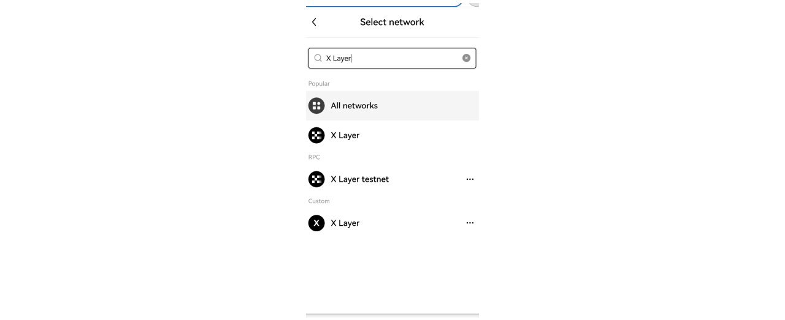

# Set up wallets

Users can use wallet such as OKX to manage your digital assets and experience our ecosystem products on the X Layer network

<Tip title="Note">
X Layer is fully compatible with Ethereum and seamlessly integrates with OKX Wallet. 

For users unfamiliar with the OKX Wallet, you can visit the [OKX Wallet FAQ site](https://www.okx.com/help/section/faq-web3-wallet "FAQ site") for more information.
</Tip>

## Install OKX wallet
The OKX wallet browser extention and mobile application come with built in network connection to X Layer.

You can choose to install OKX wallet as a [browser extension](https://chromewebstore.google.com/detail/okx-wallet/mcohilncbfahbmgdjkbpemcciiolgcge?hl=en "extension wallet") or [mobile application](https://apps.apple.com/us/app/okx-buy-bitcoin-btc-crypto/id1327268470 "mobile application").

## Access X Layer on OKX wallet
X Layer mainnet is included in the list of available networks in the OKX wallet extension by default.

You can search and select X Layer mainnet from the network drop down to connect to X Layer mainnet.

## Next steps

View the X Layer [ecosystem](https://www.okx.com/xlayer/ecosystem "ecosystem") to see list of Web3 dapps available on X Layer.

You will likely require some tokens to transact on the network. To do this, you can fund your X Layer account [here](/users/move-your-funds/fund-your-account).

## Supported wallets
Here is a of wallets supporting X Layer. You can find the relevant network information [here](/developer/build-on-xlayer/network-information).

|Wallets|Custody|Website link|Platform|Network|
|----|----|----|----|----|
|OKX Wallet|Non-custodial|https://www.okx.com/web3|Mobile, browser|Multi-chain|
|MetaMask|Non-custodial|https://metamask.io|Mobile, browser|EVM|
|Particle Network|Non-custodial|https://particle.network|Mobile, browser, embedded|Multi-chain|
|imToken|Non-custodial|https://token.im|Mobile, browser, hardware wallet|Multi-chain|